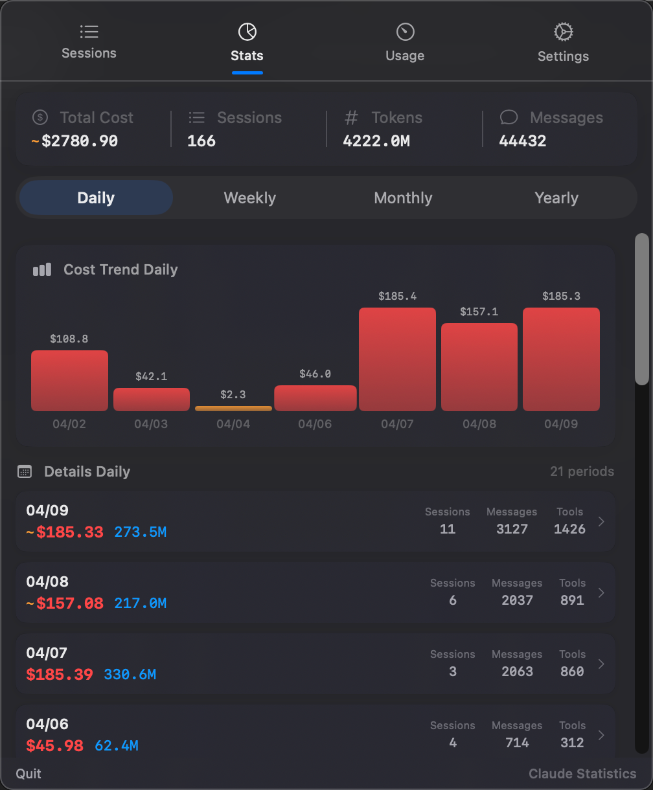
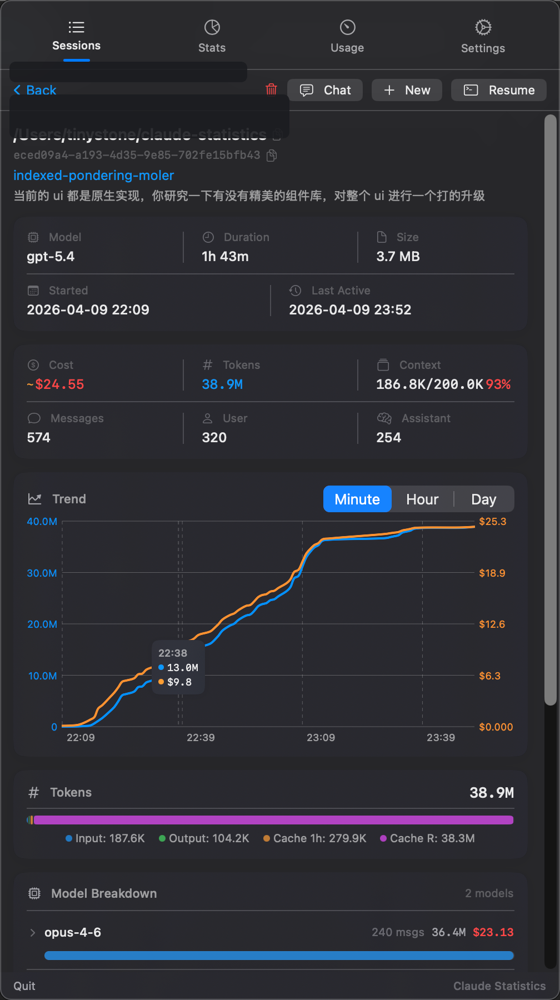
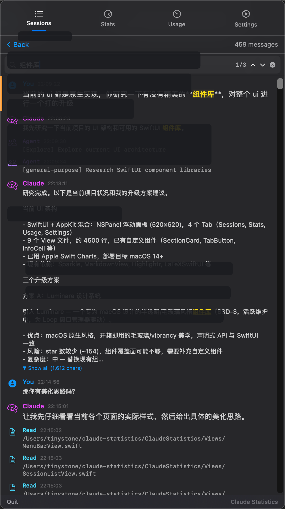
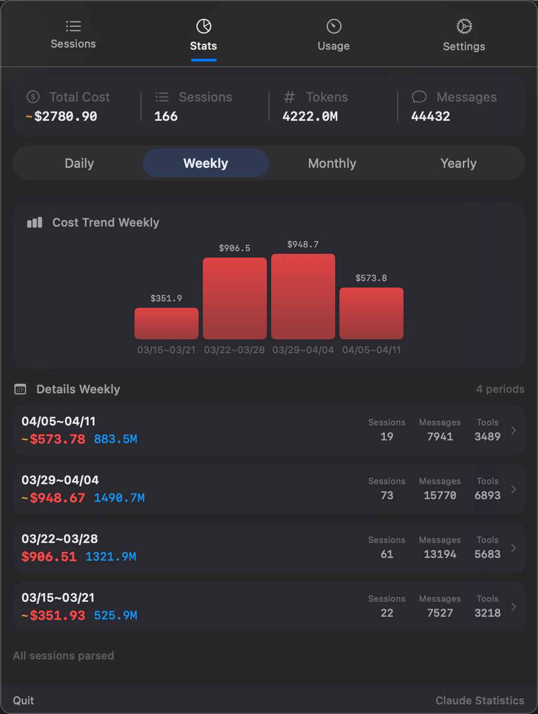
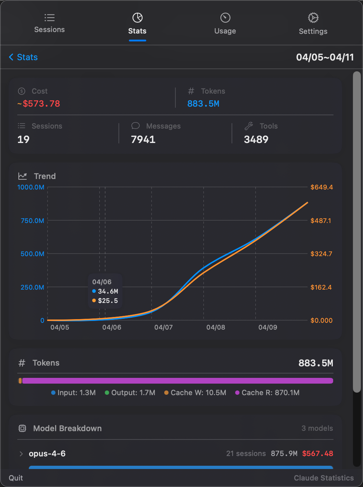
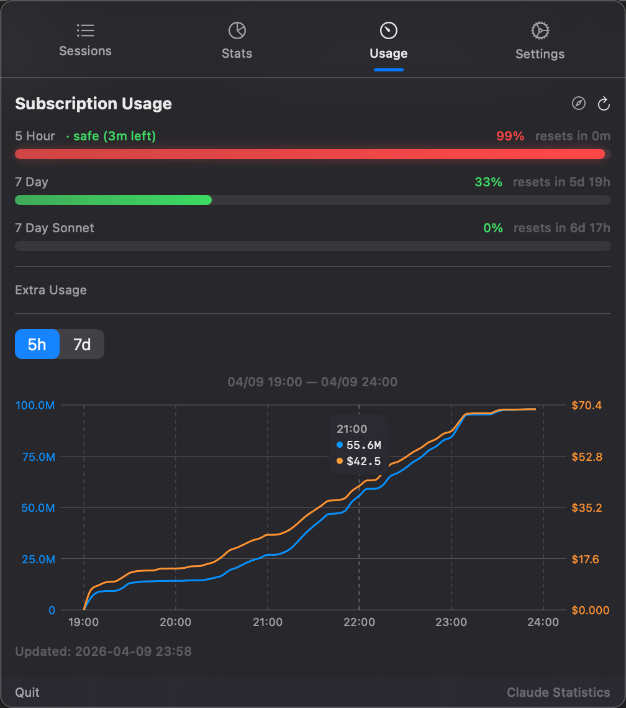

# Claude Statistics

**[中文文档](docs/README_zh.md)**

A native macOS menu bar app for monitoring your [Claude Code](https://docs.anthropic.com/en/docs/claude-code) sessions, subscription usage, and token/cost analytics in real time.

## v2.0 Highlights

Claude Statistics 2.0 is a major UI and interaction overhaul:

- Unified design system with material cards, softer shadows, and polished spacing
- Sliding capsule tab indicators and custom period pickers
- Interactive charts with hover crosshair, interpolated tooltip, and animated entry
- Refined session and statistics lists with richer hover states and smoother transitions
- Better usage monitoring with animated progress bars and trend visualization



## Screenshots

### Conversation & Detail

| Session Detail | Transcript Search |
|---|---|
|  |  |

### Statistics

| Overview | Period Detail |
|---|---|
|  |  |

### Usage



## Features

### Menu Bar Workflow

Claude Statistics lives in your macOS menu bar and opens as a floating panel.

- Native **NSStatusItem + floating panel** experience
- Reactive menu bar status text based on subscription usage
- Fast access to Sessions, Stats, Usage, and Settings from one compact panel
- No dock icon — built as a lightweight menu bar utility

### Session Management

Claude Statistics automatically discovers and parses your Claude Code sessions from `~/.claude/projects/`.

**Session List**

- Search by project path, topic, session name, or session ID
- Recent sessions section for quick access
- Grouped by project directory with expandable/collapsible sections
- Each session shows topic/title, model badge, message count, token count, cost, context usage, and timestamp
- Model-aware color badges (Opus / Sonnet / Haiku)
- Batch selection mode for bulk deletion
- Real-time updates via macOS file watching — new or modified sessions appear automatically
- Quick actions on hover: new session, resume session, open transcript, delete, copy path

**Session Detail**

- Per-session overview: model, duration, file size, start/end time
- Accurate token accounting: input, output, cache write, cache read
- Multi-model cost breakdown with per-model token usage
- Context window utilization percentage and visual indicators
- Token distribution bar with cache breakdown
- Tool usage ranking with animated progress bars
- Trend chart for session activity over time

**Session Actions**

- Resume any session in your preferred terminal
- Start a new Claude Code session in the same project
- Delete individual or multiple sessions with confirmation
- Copy session path / identifiers quickly

### Transcript Viewer & Search

Built-in transcript browsing for full conversation history.

- Full transcript viewer inside the app
- Search across conversation content and tool calls
- Match navigation (previous / next)
- Search result highlighting inside markdown content
- Dedicated rendering for tool calls, tool details, and message roles
- Markdown rendering with code block support
- Better visibility into Claude tool activity inside each session

### Statistics & Cost Analytics

Analyze usage from the local transcript data you already have.

- All-time summary: total cost, sessions, tokens, messages
- Period-based aggregation: **Daily / Weekly / Monthly / Yearly**
- Interactive cost bar chart with drill-down into period detail
- Period detail pages with overview, trend chart, token distribution, and model breakdown
- Cache token breakdown (5-minute write, 1-hour write, cache read)
- Period list optimized for fast scanning of cost and token-heavy windows
- All-time summary is computed from parsed sessions directly, so it stays stable across period switches

### Subscription Usage Monitoring

Fetches live usage data from Anthropic's OAuth-backed usage API.

- 5-hour and 7-day usage windows with utilization percentage and reset countdown
- Per-model windows (such as Opus / Sonnet) when available from the API
- Extra Usage credit tracking when available
- Usage trend chart with cumulative token and cost view
- Interpolated tooltip + crosshair for chart inspection
- Animated progress bars for rate-limit usage
- Error banner with retry action and direct link to [claude.ai/settings/usage](https://claude.ai/settings/usage)
- Configurable auto-refresh interval

### Settings & Integrations

- Launch at login
- Preferred terminal selection:
  - Auto
  - Ghostty
  - Terminal.app
  - iTerm2
  - Warp
  - Kitty
  - Alacritty
- Language selection: Auto / English / Simplified Chinese
- Font scale control
- Custom tab ordering
- Model pricing management (view, edit, fetch latest pricing)
- Claude Code status line integration using the app's pricing and usage cache
- OAuth token detection from macOS Keychain or `~/.claude/.credentials.json`
- Diagnostics log export
- Sparkle-based in-app update checks

### UI & Interaction Details

v2.0 adds many small but meaningful interaction improvements:

- Material-based cards with consistent design tokens (`Theme.swift`)
- Hover scale animation for clickable icon buttons
- Sliding capsule indicators for tab and period selection
- Chevron rotation and push transitions for expandable groups
- Chart reveal animation from left to right
- Staggered list entry animations in statistics views
- Improved hover feedback in session and statistics rows

## Requirements

- macOS 14.0+
- Xcode 16.0+ (for local development)
- [XcodeGen](https://github.com/yonaskolb/XcodeGen) (to generate the project from `project.yml`)

## Installation

### Download DMG (Recommended)

Download the latest `.dmg` from [Releases](https://github.com/sj719045032/claude-statistics/releases), open it, and drag **Claude Statistics** into **Applications**.

Because the app is not notarized by Apple, macOS may block the first launch. If that happens:

```bash
xattr -cr /Applications/Claude\ Statistics.app
```

Or right-click the app → **Open** → confirm **Open** in the dialog.

### Build from Source

```bash
# Clone the repository
git clone https://github.com/sj719045032/claude-statistics.git
cd claude-statistics

# Generate Xcode project
xcodegen generate

# Open in Xcode
open ClaudeStatistics.xcodeproj
```

For local debug runs, use the provided script:

```bash
bash scripts/run-debug.sh
```

This script builds using the dedicated debug DerivedData path and relaunches the menu bar app safely.

## How It Works

Claude Statistics uses two local-first data sources:

1. **Local transcript data**
   - Parses JSONL transcript files under `~/.claude/projects/`
   - Extracts session metadata, timestamps, token counts, model usage, tool calls, and cost estimates
   - Uses built-in model pricing tables (customizable via settings / pricing file)
   - Supports multi-model sessions and per-day slices for more accurate period attribution

2. **Anthropic usage API**
   - Uses the OAuth token stored by Claude Code in macOS Keychain or `~/.claude/.credentials.json`
   - Fetches subscription usage windows (5h / 7d / per-model when available)

All parsing and analytics happen locally on your machine.

## Architecture

```text
ClaudeStatistics/
├── App/                    # App entry, status bar controller, floating panel
├── Models/                 # Session, SessionStats, AggregateStats, UsageData, etc.
├── Services/               # Parsing, scanning, storage, pricing fetch, usage API, logs
├── Utilities/              # Terminal launching, time formatting, language handling
├── ViewModels/             # SessionViewModel, UsageViewModel, ProfileViewModel
├── Views/                  # Sessions, statistics, usage, transcript, settings, theme
├── Resources/              # Localizable strings and assets
└── scripts/                # Debug build/run and DMG release helpers
```

Notable implementation details:

- SwiftUI + AppKit hybrid architecture
- `NSStatusItem` for menu bar presence
- Custom floating panel managed by `StatusBarController`
- `Theme.swift` design-token layer for shared styling and animation
- Sparkle for in-app updates

## Build & Release

### Debug Run

```bash
bash scripts/run-debug.sh
```

This script:

1. Kills older app instances
2. Cleans stale debug builds
3. Builds with the dedicated `/tmp/claude-stats-build` DerivedData path
4. Re-registers the app with Launch Services
5. Launches the fresh binary directly

### Build DMG

```bash
bash scripts/build-dmg.sh 2.0.0
# Output: build/ClaudeStatistics-2.0.0.dmg
```

The script will:

1. Build a Release configuration with the specified version
2. Create a drag-to-install DMG
3. Sign the DMG with Sparkle's EdDSA key
4. Update `appcast.xml`

### Publish a Release

```bash
# 1. Commit and push appcast / version updates
git add ClaudeStatistics.xcodeproj/project.pbxproj appcast.xml
git commit -m "chore: update appcast for vX.Y.Z"
git push

# 2. Switch to the publishing account
gh auth switch --hostname github.com --user sj719045032

# 3. Create the GitHub release
gh release create vX.Y.Z build/ClaudeStatistics-X.Y.Z.dmg \
  --title "vX.Y.Z" --notes "Release notes"

# 4. Switch back if needed
gh auth switch --hostname github.com --user tinystone007
```

Existing users receive updates through Sparkle's in-app updater.

## Configuration

Model pricing is stored in `~/.claude-statistics/pricing.json` and can be edited manually or from the Settings tab.

| Setting | Description |
|---------|-------------|
| Launch at Login | Start Claude Statistics automatically on login |
| Auto Refresh | Refresh subscription usage data on an interval |
| Preferred Terminal | Terminal app used for resuming Claude sessions |
| Model Pricing | View, edit, or fetch latest model pricing |
| Status Line | Install/update Claude Code status line integration |
| Tab Order | Reorder the main tabs |
| Language | Auto / English / Simplified Chinese |
| Font Scale | Adjust panel content scale |
| Diagnostics | Open/export app logs |

## License

MIT
