# Claude Statistics 应用架构文档

> 最后更新：2026-04-24
> 覆盖版本：v3.1.0
> 代码规模：140 个 Swift 文件 · macOS 14+ · Swift 5.9 · SwiftUI + AppKit

本文档自下而上描述 Claude Statistics 的整体架构，涵盖应用启动、Provider 抽象、数据层、刘海屏通知系统、终端焦点回归与 SwiftUI 视图层。所有章节尽量配图表述，方便快速建立心智模型。

---

## 目录

1. [项目定位与技术栈](#1-项目定位与技术栈)
2. [模块总览与分层架构](#2-模块总览与分层架构)
3. [应用启动与顶层协调](#3-应用启动与顶层协调)
4. [Provider 多供应商架构](#4-provider-多供应商架构)
5. [数据模型与数据存储](#5-数据模型与数据存储)
6. [Notch Island 通知系统](#6-notch-island-通知系统)
7. [终端焦点回归机制](#7-终端焦点回归机制)
8. [UI 视图层](#8-ui-视图层)
9. [运行时数据流总览](#9-运行时数据流总览)
10. [附录：关键文件索引与设计决策](#10-附录关键文件索引与设计决策)

---

## 1. 项目定位与技术栈

### 1.1 定位

**Claude Statistics** 是一款 macOS 菜单栏应用，统一观察和管理三个主流 AI 编码 CLI 工具的使用情况：

| Provider | CLI | 默认日志位置 |
|----------|-----|--------------|
| **Claude** | `claude` (Claude Code) | `~/.claude/projects/**/*.jsonl` |
| **Codex** | `codex` (OpenAI Codex CLI) | `~/.codex/**/*.jsonl` + `~/.codex/state_5.sqlite` |
| **Gemini** | `gemini` (Google Gemini CLI) | `~/.gemini/**/*.json` |

核心能力：

- **统计仪表盘**：Token、成本、模型分解、项目分析、日历热力图
- **刘海屏通知（Notch Island）**：CLI 触发的权限请求、任务完成、等待输入等事件以卡片形式出现在屏幕顶部
- **终端焦点回归**：从刘海屏交互后自动把焦点切回原终端（iTerm2 / Ghostty / Kitty / WezTerm / Warp / VSCode / Cursor…）
- **多账户管理**：Claude 支持 Sync / Independent 两种账户模式（均通过 OAuth 登录，区别在凭据存储位置与多账户能力）；Codex/Gemini 使用本地凭据存储
- **分享卡片**：把使用数据生成游戏化人格卡片导出 PNG

### 1.2 技术栈

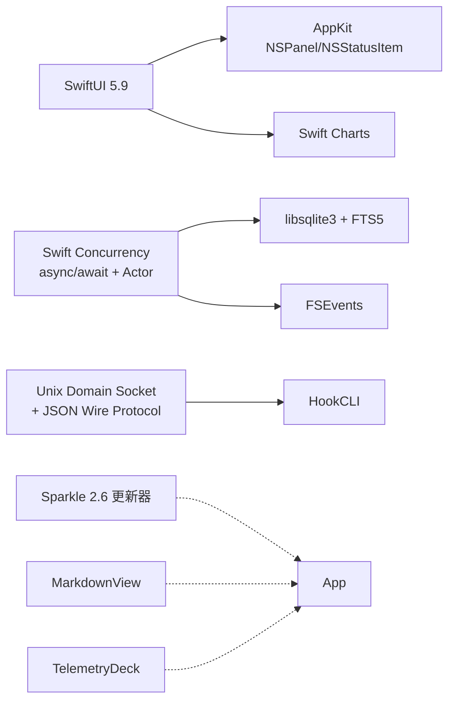

**依赖包**（见 `project.yml:15-24`）：

- **Sparkle** 2.6.0 — 自动更新（ed25519 签名，支持增量 delta 包）
- **MarkdownView** 2.6.1 — Transcript 渲染
- **TelemetryDeck** 2.0.0 — 匿名遥测
- **libsqlite3.tbd** — 会话缓存与 FTS5 全文索引

**入口配置**（`Info.plist`）：

- `LSUIElement = true`（纯菜单栏应用，无 Dock 图标）
- `NSAppleEventsUsageDescription` / `NSAccessibilityUsageDescription`（AppleScript 控制终端 + Accessibility 焦点）

---

## 2. 模块总览与分层架构

### 2.1 分层架构图

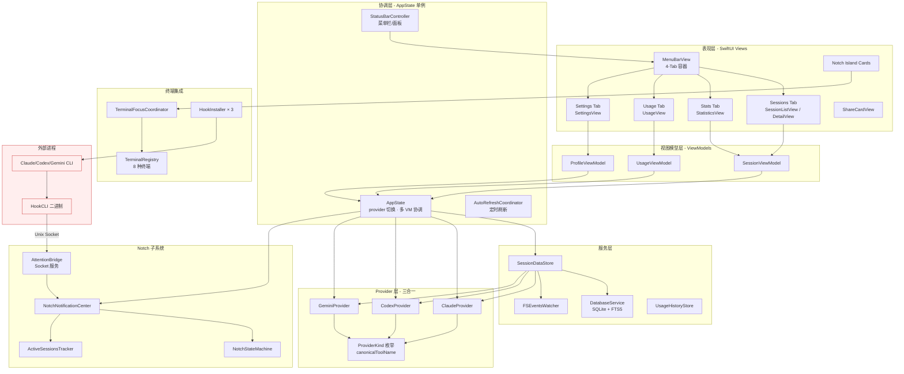

### 2.2 模块目录映射

```
ClaudeStatistics/
├── App/                  — 启动入口、AppDelegate、StatusBarController
├── HookCLI/              — Hook 二进制入口（与主 App 同一可执行文件）
├── Models/               — 领域模型（Session, ProviderKind, UsageData, ShareMetrics…）
├── ViewModels/           — MVVM 的 VM 层（3 个）
├── Views/                — SwiftUI 视图（16 个文件）
├── Services/             — DB/FS 事件/历史/分享引擎
├── Providers/            — 三个 Provider 子目录
│   ├── Claude/           — OAuth、账户管理、UsageAPI
│   ├── Codex/            — SQLite 监听、内部 API
│   └── Gemini/           — 配额桶模型、Pricing 服务
├── NotchNotifications/   — 刘海屏通知子系统
│   ├── Core/             — 事件总线、状态追踪
│   ├── UI/               — NotchWindow、卡片、状态机
│   └── Hooks/            — 3 个 Hook 安装器
├── Terminal/             — 终端注册表与能力
├── TerminalFocus/        — 焦点回归路由与 Focuser
├── Utilities/            — 工具类（AutoRefresh、HotKey、SharePNG 导出）
└── Resources/            — Localizable.strings（en / zh-Hans）
```

### 2.3 跨模块交互边界

- **UI ↔ VM**：通过 `@ObservedObject` 绑定，单向数据流
- **VM ↔ Service**：通过 `async/await` 与 `Combine @Published`
- **Service ↔ Provider**：通过 `SessionProvider` 协议多态
- **App ↔ CLI**：通过 **Unix Domain Socket + JSON 换行分隔协议**（`~/.run/attention.sock`）
- **App ↔ Terminal**：通过 AppleScript / CLI 命令 / Accessibility API / NSWorkspace activate

---

## 3. 应用启动与顶层协调

### 3.1 双入口二进制设计

一个关键设计：**主 App 和 HookCLI 使用同一可执行文件**，通过命令行参数区分入口。

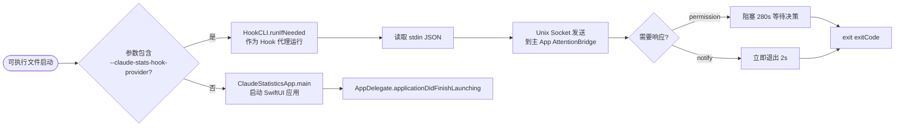

**入口实现**（`ClaudeStatistics/App/main.swift:1-8`）：

```swift
if let exitCode = HookCLI.runIfNeeded(arguments: CommandLine.arguments) {
    exit(exitCode)
}
ClaudeStatisticsApp.main()
```

好处：单一二进制 + 稳定 TCC 身份（相同 Bundle ID + 签名），HookCLI 继承主 App 的辅助功能/AppleScript 授权。

### 3.2 启动时序图

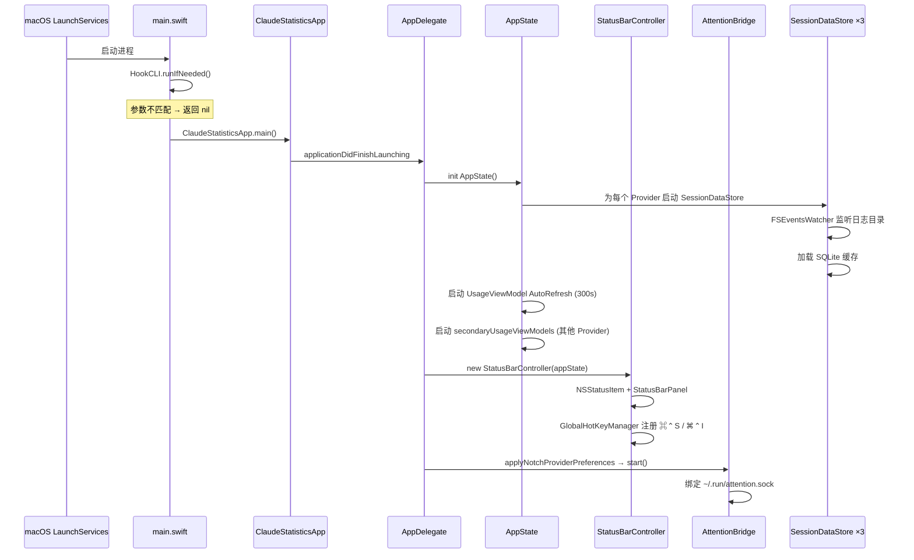

### 3.3 核心协调对象

#### AppState（全局状态中心，`ClaudeStatisticsApp.swift:26-104`）

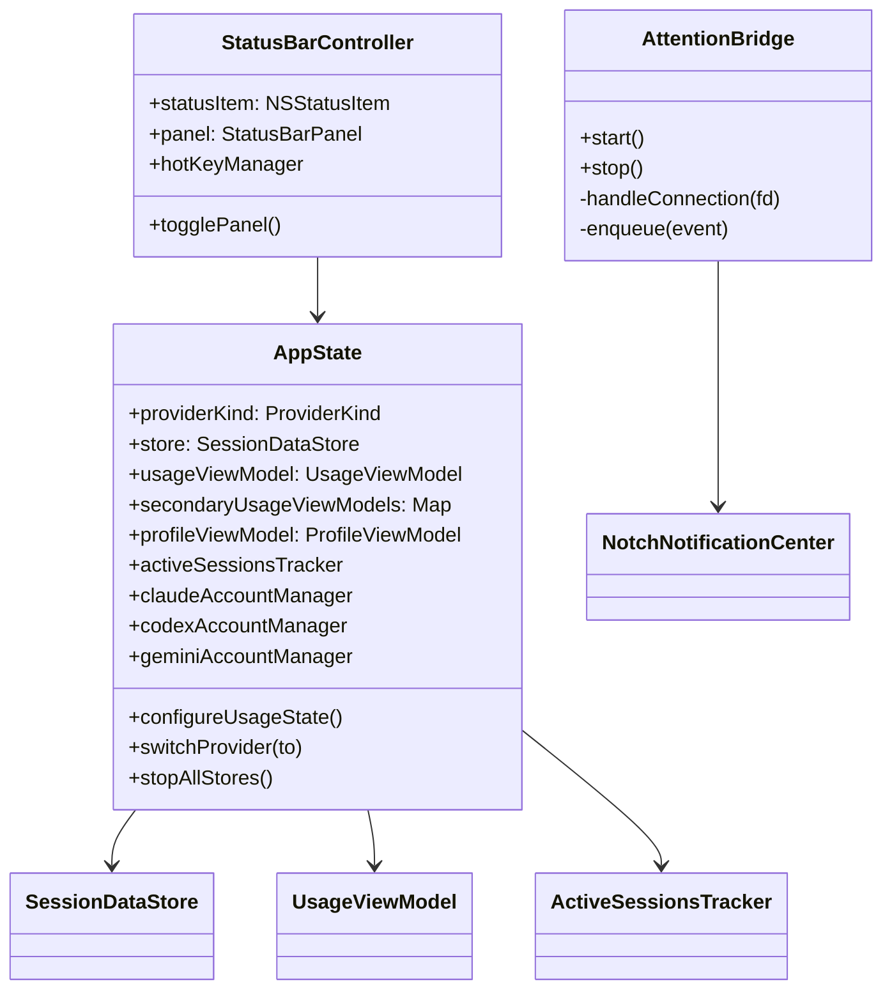

**关键字段**：

- `@Published providerKind` — 当前选中 Provider，驱动 Tab 可见性、菜单栏图标、Account 卡片
- `secondaryUsageViewModels` — 其他 Provider 的 VM 仍后台刷新，使菜单栏的 3 秒轮转策略（`MenuBarUsageStrip`）有完整数据
- `activeSessionsTracker` — 由 Notch 与菜单栏共享的活跃会话清单

#### StatusBarController（`StatusBarController.swift:57-230`）

| 职责 | 实现 |
|------|------|
| 菜单栏按钮 | NSStatusItem + MenuBarUsageStrip (SwiftUI) |
| 浮窗面板 | NSPanel (StatusBarPanel) 内嵌 PanelContentView |
| 点击切换 | `togglePanel()` |
| 点击外部关闭 | `NSEvent.addGlobalMonitorForEvents` |
| 动态宽度同步 | `MenuBarUsageStrip.onSizeChange` → `statusItem.length` |
| 全局快捷键 | ⌘⌃S 面板 / ⌘⌃I 切换 Island |
| Provider 3 秒轮转 | MenuBarUsageStrip Timer (249-268) |

### 3.4 数据刷新触发源

| 源 | 节奏 | 机制 | 影响范围 |
|---|------|------|---------|
| **定时轮询** | 300s（可配） | `AutoRefreshCoordinator` Task sleep | UsageViewModel API 拉取 |
| **API 缓存文件变化** | 实时 | `DispatchSourceFileSystemObject` | UsageViewModel 重新加载本地 JSON |
| **CLI 日志文件变化** | 实时 | `FSEventStreamCreate`（2s 防抖） | SessionDataStore 标记脏会话 |
| **面板打开** | 事件 | `popoverDidOpen()` | 立即触发脏会话解析 |
| **手动刷新** | 用户点击 | `forceRefresh()` | 强制 API + 重新扫描 |
| **NotchPreferences 变更** | NotificationCenter | `applyNotchProviderPreferences` | 启用/关闭 AttentionBridge |

---

## 4. Provider 多供应商架构

### 4.1 设计哲学：Per-Provider Data, Shared Behavior

项目的核心架构模式（见 `CLAUDE.md`）：**每个 Provider 自带它特有的数据（别名表、格式怪癖、鉴权方式），共享的是行为协议和规范化词汇**。

一个反面例子：以下代码**绝不**应该出现在共享文件（如 `ToolActivityFormatter`）里：

```swift
// ❌ 错误：把 Codex 的格式常量写进共享代码
switch providerName {
case "apply_patch": ...
case "exec_command": ...
}
```

正确姿势是让 `ProviderKind.canonicalToolName(_:)` 作为调度入口，每个 Provider 在自己的 `*ToolNames.canonical(_:)` 里维护别名表，共享代码只对规范化后的 `CanonicalToolName`（`edit` / `bash` / `read` 等）做 `switch`。

### 4.2 SessionProvider 协议与类图

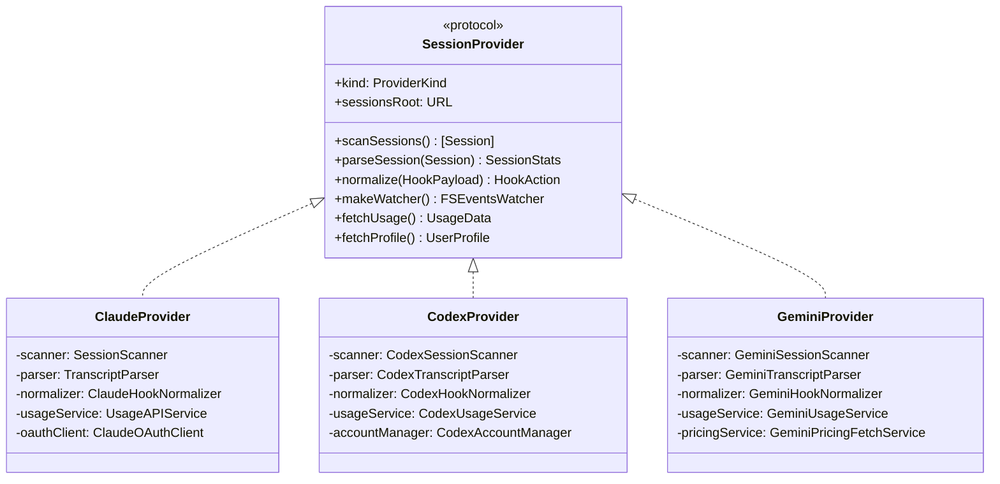

### 4.3 数据流水线：Scanner → Parser → Normalizer

每个 Provider 都执行完全相同的三步管线，具体实现各不同：

```mermaid
flowchart LR
    A[CLI 写日志文件<br/>.jsonl / .json] --> B[FSEventsWatcher<br/>2s 防抖]
    B --> C[SessionScanner<br/>枚举会话<br/>返回 Session]
    C --> D[TranscriptParser<br/>解析消息内容<br/>生成 SessionStats]
    D --> E[fiveMinSlices 时间桶<br/>Token/工具/模型]
    E --> F[DatabaseService<br/>写 SQLite + FTS]
    E --> G[@Published SessionDataStore<br/>驱动 UI]

    H[CLI 执行 hook] --> I[HookCLI 读 stdin]
    I --> J[HookNormalizer<br/>映射为 HookAction]
    J --> K[AttentionBridge<br/>via Unix Socket]
```

- **Scanner**：发现会话文件（Claude 扫 `~/.claude/projects/**/*.jsonl`，Codex 扫 `~/.codex/` 并监听 `state_5.sqlite`，Gemini 扫 `~/.gemini/**/*.json`）
- **Parser**：把原始 JSON 解码成 `TranscriptEntry` → 再聚合成 `SessionStats`
- **Normalizer**：把 Hook 事件（Claude 原生事件名、Codex 原生事件名、Gemini 的 `BeforeAgent` 等）映射到统一的 `HookAction` 模型

### 4.4 三个 Provider 的特性对比

| 维度 | Claude | Codex | Gemini |
|-----|--------|-------|--------|
| **会话日志格式** | JSONL | JSONL + state_5.sqlite | JSON |
| **账户认证** | OAuth (PKCE) + Sync / Independent 两种模式 | 本地 credentials | 本地 credentials (base64 obfuscated) |
| **Usage API** | `api.anthropic.com/api/oauth/usage` | `chatgpt.com/backend-api/wham/usage` 内部 API | 配额桶 (本地)+ Pricing 远程拉取 |
| **Usage 模型** | 5 小时 / 7 日 时间窗口 | 5 小时时间窗口 | 配额桶 (quota buckets) |
| **FS 触发策略** | 文件变化 → 脏会话 | SQLite 变化 → 全量重扫 | 文件变化 → 全量重扫（时效敏感） |
| **Hook 事件名** | 原生（PreToolUse, PostToolUse, …） | 原生 | `BeforeAgent` → 映射为 `UserPromptSubmit` 等 |
| **StatusLine 集成** | 写 `~/.claude/settings.json` 引用 shim | Codex 专属 TOML | Gemini 专属配置 |
| **特殊处理** | OAuth 回调服务器 (`ClaudeOAuthCallbackServer`) | 监听 SQLite 触发 rescan | 凭据切成 5 字符块规避 GitHub secret scan |

### 4.5 Claude 账户：两种模式

Claude 是唯一支持 OAuth 登录的 Provider。`ClaudeAccountModeController.swift:3-10` 定义了账户模式枚举，**只有两种模式**：

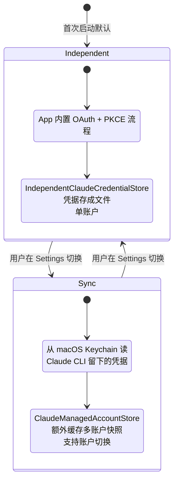

| 维度 | Sync | Independent |
|------|------|-------------|
| **凭据来源** | 复用 Claude CLI 的 macOS Keychain 条目 | App 自己跑 OAuth 拿 token |
| **登录方式** | 无需登录（依赖 CLI 已登录） | App 内 `ClaudeOAuthClient` + PKCE |
| **存储位置** | macOS Keychain | 独立文件（`IndependentClaudeCredentialStore`） |
| **账户数** | 多账户（通过 `ClaudeManagedAccountStore` 缓存切换） | 单账户 |
| **副作用** | App 升级时可能触发 Keychain ACL 提示 | 零 Keychain 提示 |
| **首次默认** | — | ✓ 所有新用户默认进 Independent |

**额外说明**：

- `ClaudeManagedAccountStore` **不是**第三种模式——它只是 **Sync 模式下**的多账户快照存储（见 `ClaudeAccountManager.swift:342`：只有 `mode == .sync` 才加载 managedAccounts）。
- `ClaudeCredentialSource`（`file / keychain / backup / independent`）是读取凭据时的溯源枚举，不是用户可选的"模式"。
- **OAuth 本身不是一种模式**：两种模式都用 OAuth，区别只在凭据的存储位置与生成方式。Sync 让 CLI 负责 OAuth，Independent 让 App 自己跑 OAuth。

### 4.6 规范化工具名机制（CanonicalToolName）

不同 Provider 对"编辑文件"的称呼各异：

| Provider | 原始名 |
|----------|--------|
| Claude | `Edit` |
| Codex | `apply_patch` |
| Gemini | `replace` |

规范化路径：

```
Provider 原始名
  ↓  ProviderKind.canonicalToolName(rawName)
  ↓  switch self {
  ↓    case .claude: ClaudeToolNames.canonical(rawName)
  ↓    case .codex:  CodexToolNames.canonical(rawName)
  ↓    case .gemini: GeminiToolNames.canonical(rawName)
  ↓  }
CanonicalToolName.edit
  ↓  CanonicalToolName.displayName(for:)
"Edit"   （本地化后的统一 UI 文本）
```

- 共享代码仅依赖 `CanonicalToolName`，加新 Provider 不改共享文件
- 当调用方没有 `ProviderKind` 上下文时用 `CanonicalToolName.resolve(_:)`，它依次尝试各 Provider 的表

### 4.7 OAuth 流程（仅 Claude Independent 模式）

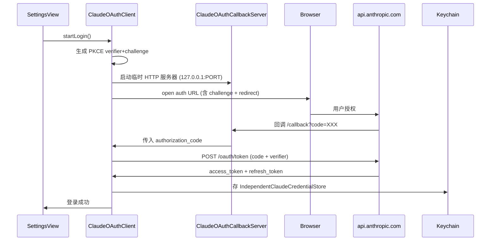

---

## 5. 数据模型与数据存储

### 5.1 领域模型关系图

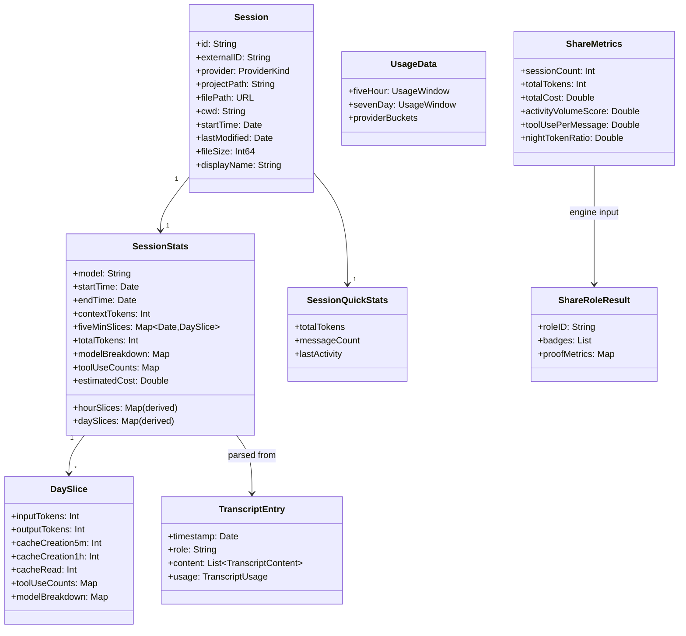

**关键设计**：`SessionStats.fiveMinSlices` 是 **唯一持久化的时间序列**，小时/日粒度均由其推导（`Session.swift:112-133`）。保证聚合一致性。

### 5.2 SQLite Schema

**路径**：`~/Library/Application Support/ClaudeStatistics/Data.db`

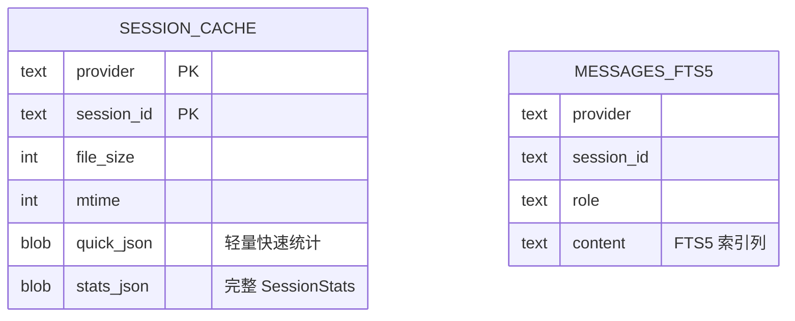

**配置**：

- WAL 模式（`DatabaseService.swift:35`） + `PRAGMA synchronous = NORMAL` 提升并发写入
- **原子事务**（`:289-354`）：`stats_json` + FTS 索引同时写或全部回滚，绝不出现"有统计但搜不到"的半状态
- 数据库版本迁移（`:78-109`）

### 5.3 SessionDataStore 缓存与刷新策略

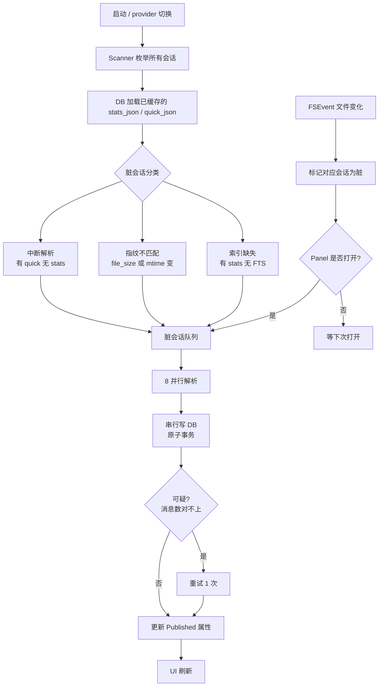

**关键点**（`SessionDataStore.swift:88-439`）：

- **并行度 8**：解析并行 8 个会话，但 DB 写入串行化避免锁争用
- **指纹检测**：`fileSize + mtime` 作为脏判据，不对内容做 hash（代价太高）
- **崩溃恢复优先**：有 `quick_json` 无 `stats_json` 的会话优先处理（上次进程崩溃的遗留）
- **重试不落盘**：可疑结果重试一次仍不对就保留上次承诺版本，不写入脏数据

### 5.4 FSEventsWatcher 监听链

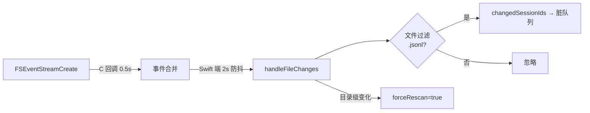

- **两级防抖**：C 层 0.5s + Swift 层 2s，避免 CLI 写入 JSONL 时的高频抖动触发大量解析
- **过滤器可注入**：`fileFilter` 默认 `.hasSuffix(".jsonl")`，Gemini 用 `.json`
- **两种输出**：单文件变化（快速路径，重解析单个会话）/ 结构变化（慢速路径，全量重扫）

### 5.5 Service 层职责清单

| 服务 | 职责 |
|-----|------|
| **DatabaseService** | SQLite 连接池、事务、FTS5 索引、migration |
| **SessionDataStore** | 内存缓存 + 解析编排 + UI 发布（每 Provider 一个实例） |
| **FSEventsWatcher** | 文件系统事件源 + 脏标记 |
| **UsageHistoryStore** | 每次 API 拉取的 7 日样本窗口，追加写 JSONL |
| **ShareMetricsBuilder** | `PeriodStats` → `ShareMetrics`（衍生指标计算） |
| **ShareRoleEngine** | `ShareMetrics` → `ShareRoleResult`（9 个角色评分匹配） |
| **UpdaterService** | Sparkle 包装，检查更新、delta 下载 |
| **DiagnosticLogger** | 结构化日志，写 `~/Library/Logs/ClaudeStatistics/` |

---

## 6. Notch Island 通知系统

### 6.1 子系统概览

Notch Island 是本项目的标志性特色：把 CLI hook 事件转化为屏幕顶部动态岛式卡片。

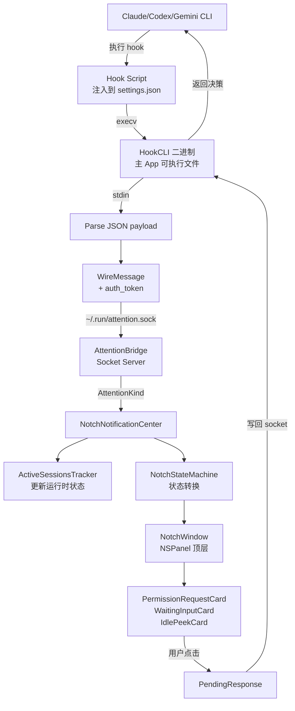

### 6.2 完整事件时序

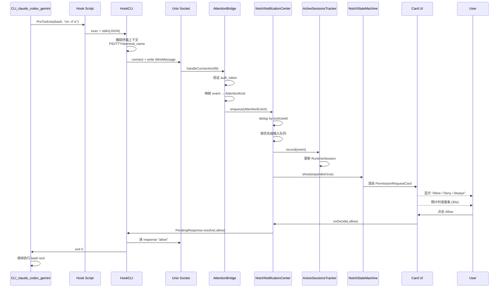

### 6.3 AttentionBridge：Unix Socket 服务

**套接字路径**（`AttentionBridge.swift`）：

- Release：`~/.run/attention.sock`
- Debug：`~/.run/attention-debug.sock`（Debug 与 Release 隔离，同机并存不冲突）

**鉴权**：

- Token 写在 `~/.run/attention-token`（权限 `0o600`，仅当前用户可读）
- 每条消息携带 `auth_token`，服务端验证后接受

**协议**：JSON + `\n` 分隔的行式消息

```json
{
  "v": 1,
  "auth_token": "...",
  "provider": "claude",
  "event": "PermissionRequest",
  "tool_name": "bash",
  "tool_input": {"command": "rm -rf /tmp/x"},
  "tool_use_id": "toolu_...",
  "expects_response": true,
  "timeout_ms": 30000,
  "session_id": "sess_...",
  "cwd": "/Users/me/project",
  "pid": 12345,
  "tty": "/dev/ttys001",
  "terminal_name": "iTerm2",
  "terminal_socket": "...",
  "terminal_window_id": "1",
  "terminal_surface_id": "..."
}
```

### 6.4 AttentionKind 与优先级

```
优先级 1: .permissionRequest(tool, input, toolUseId, interaction)   ← 最高
优先级 2: .taskFailed(summary)
优先级 3: .waitingInput(message)
优先级 4: .taskDone(summary)
优先级 5: .sessionStart(source)
优先级 6: .activityPulse                                            ← 静默追踪
优先级 7: .sessionEnd                                               ← 最低
```

**自动消失**：

| Kind | 超时 | 悬停暂停? |
|------|-----|----------|
| sessionStart | 5s | 否 |
| taskDone | 10s | 是 |
| permissionRequest / waitingInput | **永不超时** | — |
| activityPulse / sessionEnd | 不弹出 | — |

### 6.5 NotchStateMachine 状态图

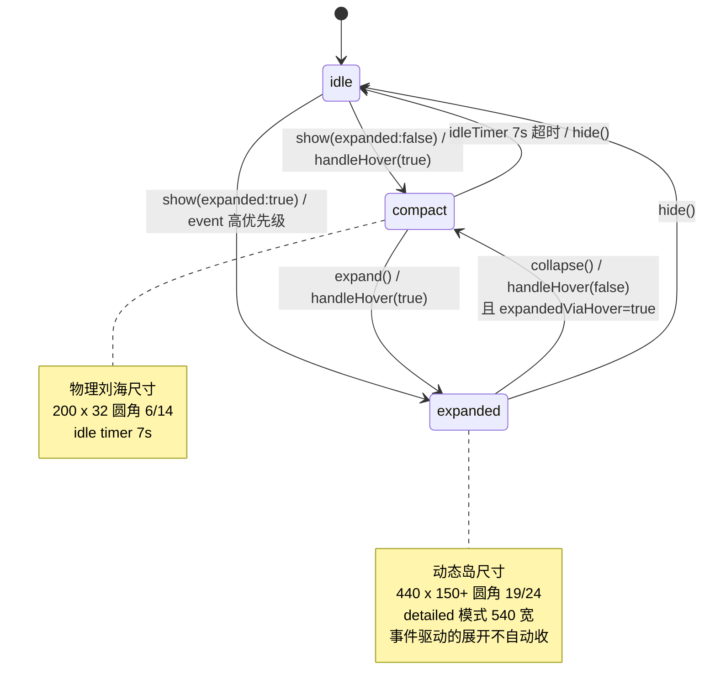

**关键逻辑**：`expandedViaHover` 标记区分"用户悬停偷看"与"事件驱动的持久卡"。前者鼠标离开立即收起，后者必须用户处理或手动关闭。

### 6.6 NotchWindow 渲染技巧

```swift
// 高于菜单栏 3 层 —— 可悬浮在全屏应用之上
level = NSWindow.Level(rawValue:
    Int(CGWindowLevelForKey(.mainMenuWindow)) + 3)

backgroundColor = .clear
isOpaque = false
hasShadow = false

collectionBehavior = [
    .canJoinAllSpaces,    // 所有 Space 可见
    .stationary,          // 切 Space 不跟随
    .fullScreenAuxiliary  // 全屏应用之上
]
```

窗口框是 640×360 的"信封"，实际卡片内容居中，绕开 macOS 不允许子视图越过窗口边界的限制。

### 6.7 ActiveSessionsTracker：多会话运行时

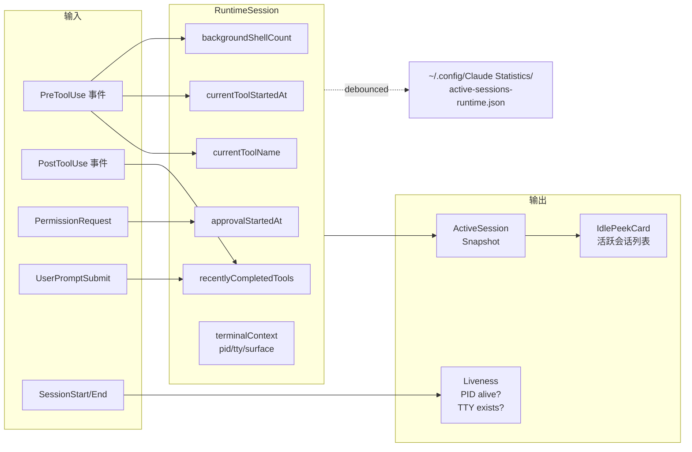

**特殊处理**：

- **Ctrl+Z 检测**：用 `proc_pidinfo()` + `SSTOP` flag 判断进程是否被挂起
- **Ghostty ID 冲突**：Ghostty 可能在分屏不同 TTY 复用同一个 stable ID，代码检测冲突后清除歧义身份
- **Tab 位移**：同一终端 Tab 新开会话时移除旧会话，避免僵尸展示
- **持久化**：防抖后写入 JSON 文件，App 重启合并恢复

### 6.8 Hook Installer 安装流程

三个 Installer 都继承 `HookInstaller` 基类：

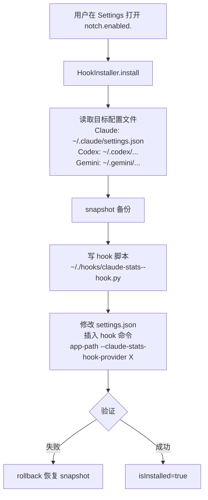

**幂等标记**：搜 `"--claude-stats-hook-provider"` 字符串判断是否已安装；卸载时删除匹配项。

### 6.9 NotchNotificationCenter 队列管理

职责汇总：

- **去重**：同 `toolUseId` 的 PermissionRequest 视为同一事件，新的覆盖旧的
- **优先级插入**：高优先级永远挤到队首
- **超时调度**：为有 timeout 的事件启动 `Timer` 自动消失
- **发布当前事件**：`@Published currentEvent` 驱动 UI
- **音效**：收到 PermissionRequest 播放 `NSSound(named: "Hero")`（可配置）

---

## 7. 终端焦点回归机制

### 7.1 问题定义

当用户在 Notch 上点击 "Allow" 后，焦点停在 Notch 上；而用户的 CLI 在某个终端里运行——需要**精准把焦点送回那个终端的那个 Tab/Window/Split**，而不是随便打开一个终端。

### 7.2 支持的终端注册表

`TerminalRegistry.swift:4-12` 注册（按优先级）：

```
1. Ghostty       (com.mitchellh.ghostty)
2. WezTerm       (com.github.wez.wezterm)
3. iTerm2        (com.googlecode.iterm2)
4. Apple Terminal
5. Warp          (dev.warp.Warp-Stable)
6. Kitty         (net.kovidgoyal.kitty)
7. Alacritty     (org.alacritty)
8. Editor        (VSCode / Cursor / JetBrains …)
+ Hyper (ExternalTerminalCapability)
```

每个终端实现一个 `TerminalCapability` 协议的子类，声明支持的焦点策略。

### 7.3 焦点回归决策流

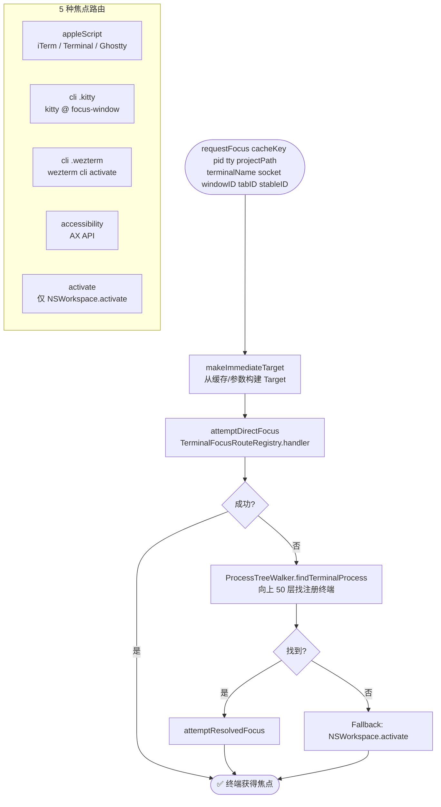

### 7.4 路由与 Handler 对照

| Route | Handler | 执行链 |
|-------|---------|-------|
| `.appleScript` | AppleScriptTerminalFocusRouteHandler | AppleScript → AccessibilityFocuser → ActivateFocuser |
| `.cli(.kitty)` | CLITerminalFocusRouteHandler | KittyFocuser → Accessibility → Activate |
| `.cli(.wezterm)` | CLITerminalFocusRouteHandler | WezTerm CLI → Accessibility → Activate |
| `.accessibility` | AccessibilityTerminalFocusRouteHandler | 仅 AccessibilityFocuser |
| `.activate` | ActivateTerminalFocusRouteHandler | 仅 NSWorkspace.activate |

每个 handler 都采用"主策略 + fallback"三段式，任一成功即退出。

### 7.5 Kitty 特殊处理

Kitty 支持 **Remote Control**：

```bash
kitty @ --to unix:/tmp/kitty-user-stone focus-window --match id:<window_id>
```

但需要先在 `kitty.conf` 开启：

```
allow_remote_control socket-only
listen_on unix:/tmp/kitty-<username>
```

**`KittyFocusSetup.ensureConfigured()`**（`KittyFocusSetup.swift:65-100`）自动向 `~/.config/kitty/kitty.conf` 注入这两行，并在首次检测到 Kitty 时提示用户重启它。

**socket 动态发现**（`KittyFocuser.swift:137-220`）：

1. 先读 `kitty.conf` 的 `listen_on`
2. 扫描 `~/.config/kitty/` 下匹配 `kitty-user-*` 的 socket，按 mtime 取最新
3. 多个 kitty 实例时 socket 可能变化，所以每次都动态解析

### 7.6 Ghostty 特殊处理

Ghostty 暂不开放 Remote Control，只能 AppleScript（`GhosttyInspector.swift:4-24`）：

```applescript
tell application id "com.mitchellh.ghostty"
  if not frontmost then return "miss"
  set termRef to focused terminal of selected tab of front window
  return "ok|" & (id of termRef as text)
end tell
```

HookCLI 在消息里附带 Ghostty 的 **stable surface ID**，焦点回归时 AppleScript 扫所有窗口匹配 ID。

### 7.7 ProcessTreeWalker：进程树回溯

当 cache 失效或 hook 提供的 PID 已死，需要从项目路径反查终端进程：

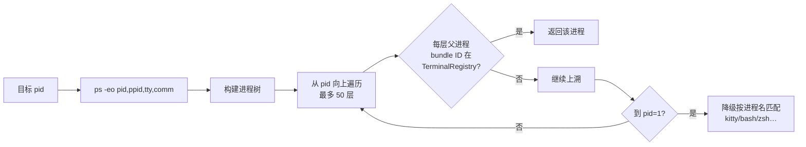

另一个入口：`findClaudeProcess(projectPath:)` 先找 Claude CLI 进程（通过 cwd 匹配），再向上找终端。

### 7.8 焦点身份缓存

`TerminalFocusCoordinator.cachedTargets: [String: TerminalFocusTarget]`：

- **Key**：session_id（hook 传入）
- **Value**：上次成功的终端身份（pid / bundleId / socket / IDs）
- **失效规则**：新 request 若携带新的明确 terminal IDs 并与缓存不符 → 使用新身份

---

## 8. UI 视图层

### 8.1 视图层级总图

```mermaid
graph TB
    SBC[StatusBarController] --> Panel[StatusBarPanel NSPanel]
    Panel --> PCV[PanelContentView]
    PCV --> MBV[MenuBarView 主容器]

    MBV --> TB[Tab Bar]
    MBV --> BN[Banners<br/>UpdateBanner / TerminalSetupBanner]
    MBV --> CA[Content Area]
    MBV --> FT[Footer]

    TB --> T1[Sessions]
    TB --> T2[Stats]
    TB --> T3[Usage]
    TB --> T4[Settings]

    CA --> SV1[SessionListView<br/>+ SessionDetailView<br/>+ TranscriptView]
    CA --> SV2[StatisticsView<br/>+ PeriodDetailView]
    CA --> SV3[UsageView<br/>+ UsageTrendChartView]
    CA --> SV4[SettingsView]

    SV1 --> PAV[ProjectAnalyticsView]
    SV4 --> Subs["6 个可展开子面板<br/>Pricing / Notch / HotKeys / Terminal / Focus / Dev"]

    MBV --> Sheets[Sheets]
    Sheets --> TSS[TerminalSetupSheetView]
    Sheets --> SCV[ShareCardView<br/>via SharePreview]
```

### 8.2 菜单栏面板信息架构

面板整体尺寸 480–800 × 520–900 px（响应式），主要由 `MenuBarView.swift` 组织：

| 区域 | 内容 |
|------|------|
| **顶部 Tab Bar** | 4 个 Tab + `matchedGeometryEffect` 动画指示器 |
| **Banners** | 可用更新提示 + 终端配置缺失提示 |
| **Content** | GeometryReader 自适应 + 切换动画 |
| **Footer** | 退出按钮 / Parse 进度条 / 分享入口 / Provider 切换器 |

**Tab 动态可见性**：

```swift
// Usage Tab 只在 provider 支持 usage API 时才显示
ProviderCapabilities(providerKind).supportsUsage
```

### 8.3 View 与 ViewModel 绑定

```
MenuBarView (多数 Tab 共享这些绑定)
├─ @ObservedObject appState: AppState
├─ @ObservedObject usageViewModel: UsageViewModel
├─ @ObservedObject profileViewModel: ProfileViewModel
├─ @ObservedObject sessionViewModel: SessionViewModel
├─ @ObservedObject store: SessionDataStore
├─ @ObservedObject updaterService: UpdaterService
├─ @StateObject   toastCenter: ToastCenter
└─ @StateObject   terminalSetupCoordinator
```

**响应链示例**：

- `store.parseProgress` → Footer 进度条实时更新
- `appState.providerKind` → Tab 可见性过滤 + 菜单栏图标切换
- `sessionViewModel.selectedSession` → SessionDetailView 显示/隐藏
- `updaterService.availableVersion` → 更新 Banner

### 8.4 Theme 系统

`Theme.swift` 定义的设计令牌（Design Tokens）：

| 类别 | Token |
|------|-------|
| **Spacing** | cardPadding (12), sectionSpacing (12) |
| **Radius** | cardRadius (10), badgeRadius (4), barRadius (5) |
| **Shadows** | cardShadowColor (.black 0.06) |
| **Animation** | springAnimation (0.35s), quickSpring (0.25s), tabAnimation (0.3s) |
| **Model Colors** | opus → purple, sonnet → blue, haiku → teal |
| **Cost Gradient** | 成本 > 5.0 红 / > 1.0 橙 / else 绿 |

自定义 Modifier：`CardStyle`、`shimmer()`、`HoverScaleButtonStyle`。

### 8.5 分享功能

```mermaid
sequenceDiagram
    participant U as User
    participant MBV as MenuBarView
    participant SMB as ShareMetricsBuilder
    participant SRE as ShareRoleEngine
    participant SCV as ShareCardView
    participant SIE as ShareImageExporter
    participant SPW as SharePreviewWindow

    U->>MBV: 点击分享
    MBV->>SMB: build(periodStats)
    SMB->>SMB: 派生指标<br/>activityVolume / nightRatio
    SMB->>SRE: evaluate(metrics)
    SRE->>SRE: 9 个角色评分
    SRE-->>MBV: ShareRoleResult
    MBV->>SPW: 打开预览浮窗
    SPW->>SCV: 渲染 SwiftUI 卡片
    U->>SPW: 点击"复制到剪贴板"
    SPW->>SIE: render(view)
    SIE->>SIE: ImageRenderer → NSImage
    SIE->>SIE: PNG → Pasteboard
    SIE-->>U: 提示已复制
```

9 个角色（`ShareRole.swift`）：`vibeCodingKing`, `toolSummoner`, `contextBeastTamer`, `nightShiftEngineer`, `multiModelDirector`, `efficientOperator`, `sprintHacker`, `fullStackPathfinder`, `steadyBuilder`。

### 8.6 终端配置 Sheet 流程

```mermaid
stateDiagram-v2
    [*] --> NotReady: 用户启用 Notch 但终端不可用
    NotReady --> Banner: MenuBarView 显示 TerminalSetupBanner
    Banner --> Sheet: 点击 "Set Up"
    Sheet --> Action: 用户选择 Action
    Action --> Fix: runAutomaticFix
    Action --> Config: openConfigFile
    Action --> App: openApp
    Fix --> Verify: 回到 Readiness 检测
    Config --> Verify
    App --> Verify
    Verify --> Ready: 所有要求满足
    Verify --> NotReady: 仍有缺陷
    Ready --> [*]
```

`TerminalSetupSheetView` 展示 `unmetRequirements` 列表 + 一键修复按钮 + 精度标签（"exact" / "best effort" / "app-only"）。

---

## 9. 运行时数据流总览

### 9.1 完整数据流：从 CLI 到 UI

```mermaid
graph TB
    subgraph "读路径（数据摄入）"
        A1[CLI 写 JSONL 日志] --> A2[FSEventsWatcher<br/>2s 防抖]
        A2 --> A3[SessionScanner 发现]
        A3 --> A4[TranscriptParser 解析]
        A4 --> A5[SessionStats + DaySlice]
        A5 --> A6[DatabaseService 写 SQLite]
        A5 --> A7[SessionDataStore @Published]
        A7 --> A8[ViewModel]
        A8 --> A9[SwiftUI View]

        B1[CLI 执行 hook] --> B2[HookCLI 进程]
        B2 --> B3[HookNormalizer]
        B3 --> B4[AttentionBridge<br/>via Unix Socket]
        B4 --> B5[NotchNotificationCenter]
        B5 --> B6[NotchStateMachine]
        B6 --> B7[NotchWindow]
        B4 --> B8[ActiveSessionsTracker]

        C1[UsageAPI 远程] --> C2[UsageViewModel<br/>AutoRefresh 300s]
        C2 --> C3[UsageHistoryStore<br/>追加 JSONL]
        C2 --> A8
        C2 --> C4[UsageCacheWatcher<br/>本地 JSON 变化]
    end

    subgraph "写路径（用户交互）"
        D1[用户点击 Notch Allow] --> D2[PendingResponse]
        D2 --> D3[socket write 决策]
        D3 --> D4[HookCLI 读响应]
        D4 --> D5[CLI 继续/中止]

        E1[用户点击焦点回归] --> E2[TerminalFocusCoordinator]
        E2 --> E3{Route 决策}
        E3 --> E4[AppleScript/CLI/AX/Activate]
        E4 --> E5[终端获得焦点]

        F1[用户登录 Claude] --> F2[ClaudeOAuthClient]
        F2 --> F3[Callback Server]
        F3 --> F4[Token Exchange]
        F4 --> F5[Keychain Store]
    end
```

### 9.2 时间维度：每秒钟发生什么

以一个用户正在用 Claude Code 写代码为例：

```
T+0ms    用户在终端输入 prompt
T+100ms  Claude CLI 决定调用 bash tool
T+120ms  CLI 写 JSONL log (triggers FSEvent)
T+120ms  CLI fork HookCLI --claude-stats-hook-provider claude
T+125ms  HookCLI 读 stdin(PermissionRequest)
T+130ms  HookCLI connect Unix socket
T+135ms  AttentionBridge accept + parse
T+140ms  NotchNotificationCenter enqueue + 播放 Hero 声音
T+145ms  NotchWindow 从 idle → expanded
T+150ms  PermissionRequestCard 显示
...
T+620ms  FSEventWatcher 触发第一波(被 2s 防抖吞掉)
T+2620ms 防抖结束 → SessionDataStore 标记脏会话
T+2625ms (若面板关闭)等待下次打开才解析
...
T+8000ms 用户点击 Allow
T+8005ms PendingResponse.resolve(.allow)
T+8010ms HookCLI 读到 "allow" → exit 0
T+8015ms CLI 执行 bash tool
T+8500ms CLI 写 PostToolUse log
T+8505ms 新一轮 FSEvent...
```

---

## 10. 附录：关键文件索引与设计决策

### 10.1 关键文件速查表

#### 启动与顶层

| 文件 | 作用 |
|------|------|
| `App/main.swift` | 进程入口，双模式分派 |
| `App/ClaudeStatisticsApp.swift` | SwiftUI App + AppDelegate + AppState |
| `App/StatusBarController.swift` | 菜单栏 NSStatusItem + 面板 |
| `App/StatusBarPanel.swift` | NSPanel 自定义 |
| `HookCLI/HookCLI.swift` | Hook 代理入口 + 终端上下文探测 |

#### Provider

| 文件 | 作用 |
|------|------|
| `Models/ProviderKind.swift` | Provider 枚举 + canonicalToolName 调度 |
| `Providers/Claude/ClaudeProvider.swift` | Claude Provider 实现 |
| `Providers/Claude/ClaudeOAuthClient.swift` | OAuth + PKCE |
| `Providers/Claude/ClaudeOAuthCallbackServer.swift` | OAuth 回调服务器 |
| `Providers/Claude/UsageAPIService.swift` | Anthropic Usage API |
| `Providers/Codex/CodexProvider.swift` | Codex Provider 实现 |
| `Providers/Codex/CodexUsageService.swift` | ChatGPT 内部 API |
| `Providers/Gemini/GeminiProvider.swift` | Gemini Provider 实现 |
| `Providers/Gemini/GeminiPricingFetchService.swift` | 远程拉取价格表 |

#### 数据层

| 文件 | 作用 |
|------|------|
| `Services/DatabaseService.swift` | SQLite + FTS5 |
| `Services/SessionDataStore.swift` | 内存缓存 + 解析编排 |
| `Services/FSEventsWatcher.swift` | 文件系统监听 |
| `Services/UsageHistoryStore.swift` | Usage 样本历史 |
| `Services/ShareMetricsBuilder.swift` | 分享指标计算 |
| `Services/ShareRoleEngine.swift` | 角色评分 |
| `Services/UpdaterService.swift` | Sparkle 封装 |
| `Models/Session.swift` | Session / SessionStats / DaySlice |
| `Models/UsageData.swift` | Usage API 响应 |

#### Notch 子系统

| 文件 | 作用 |
|------|------|
| `NotchNotifications/Core/AttentionBridge.swift` | Unix Socket 服务 |
| `NotchNotifications/Core/AttentionEvent.swift` | 事件枚举 + 优先级 |
| `NotchNotifications/Core/NotchNotificationCenter.swift` | 事件队列 + 去重 + 超时 |
| `NotchNotifications/Core/ActiveSessionsTracker.swift` | 多会话运行时 |
| `NotchNotifications/UI/NotchStateMachine.swift` | idle/compact/expanded 状态机 |
| `NotchNotifications/UI/NotchWindow.swift` | NSPanel 自定义 |
| `NotchNotifications/UI/Cards/PermissionRequestCard.swift` | 权限审批卡 |
| `NotchNotifications/UI/Cards/WaitingInputCard.swift` | 等待输入卡 |
| `NotchNotifications/Hooks/HookInstaller.swift` | 安装器基类 |

#### 终端焦点

| 文件 | 作用 |
|------|------|
| `Terminal/TerminalRegistry.swift` | 终端注册表 |
| `Terminal/Capabilities/*.swift` | 8 种终端能力实现 |
| `TerminalFocus/TerminalFocusCoordinator.swift` | 焦点请求编排 + 缓存 |
| `TerminalFocus/TerminalFocusRoute.swift` | 路由枚举 |
| `TerminalFocus/TerminalFocusRouteHandler.swift` | 5 种路由 handler |
| `TerminalFocus/ProcessTreeWalker.swift` | 进程树回溯 |
| `TerminalFocus/KittyFocuser.swift` | Kitty 远程控制 |
| `TerminalFocus/KittyFocusSetup.swift` | Kitty 配置自动化 |
| `TerminalFocus/GhosttyInspector.swift` | Ghostty AppleScript |

#### UI

| 文件 | 作用 |
|------|------|
| `Views/MenuBarView.swift` | 主容器 + 4 Tab |
| `Views/StatisticsView.swift` | 周期统计 + 图表 |
| `Views/UsageView.swift` | Usage 窗口/配额桶 |
| `Views/SessionListView.swift` | 会话列表 + 搜索 |
| `Views/SessionDetailView.swift` | 会话详情 |
| `Views/TranscriptView.swift` | 完整对话渲染（MarkdownView） |
| `Views/ProjectAnalyticsView.swift` | 项目聚合 |
| `Views/ShareCardView.swift` | 分享卡片 |
| `Views/SettingsView.swift` | 设置总入口 |
| `Views/Theme.swift` | 设计令牌 |

### 10.2 关键设计决策摘要

| 决策 | 原因 | 替代方案 |
|------|------|---------|
| **单二进制双入口** | HookCLI 继承主 App 的 TCC 权限；部署简单 | 分离 CLI 二进制（会多次 prompt 授权） |
| **Unix Socket + JSON** | 轻量、无依赖、天然本地鉴权；支持双向阻塞等待 | XPC（复杂、mach port 配置繁琐）、NSDistributedNotification（无响应通道） |
| **fiveMinSlices 单源** | 所有聚合由 5 分钟桶推导，避免多源不一致 | 分别存 hour/day 粒度（冗余 + 更新成本） |
| **ProviderKind 枚举调度** | 新增 provider 只改自己的文件 + `switch` | 动态反射注册（类型安全差） |
| **SQLite + FTS5** | 文件解析慢 → 必须缓存；FTS 支持内容搜索 | SwiftData（FTS 支持弱）、纯 JSON（搜索慢） |
| **FSEvents 2s 防抖** | CLI 写 JSONL 高频抖动 | inotify-style 无防抖（会过度触发解析） |
| **Notch NSPanel level +3** | 需悬浮在全屏应用和菜单栏之上 | 常规 window level（会被覆盖） |
| **Kitty 自动改配置** | 非侵入的 focus-window 唯一路径 | 仅 Accessibility（精度不够） |
| **Claude 三账户模式** | 满足个人 / 独立 / 企业三种使用场景 | 只 Sync（失去独立控制） |

### 10.3 扩展指南

**加一个新 Provider**：

1. 创建 `Providers/<Name>/<Name>Provider.swift` 实现 `SessionProvider`
2. 创建 Scanner / Parser / Normalizer 三兄弟
3. 在 `Models/ProviderKind.swift` 加枚举值 + `canonicalToolName` switch 分支
4. 在 `NotchNotifications/Hooks/<Name>HookInstaller.swift` 写 hook 注入
5. UI 自动获得 Tab/图标/账户卡（因为都通过 ProviderKind switch）

**加一个新终端**：

1. 创建 `Terminal/Capabilities/<Name>TerminalCapability.swift`
2. 注册到 `TerminalRegistry`
3. 若需专属焦点路径，在 `TerminalFocus/` 加 Focuser 并注册到 `TerminalFocusRouteRegistry`
4. HookCLI 里（`HookCLI.swift:425-516`）加环境变量探测分支

**加一个新 Hook 事件**：

1. `AttentionKind` 加枚举值 + 优先级
2. `AttentionBridge.swift:164-206` 的 `event → AttentionKind` 映射加分支
3. UI 层添加对应 Card（若需要）
4. 若三个 Provider 的原生事件名不同，各自 Normalizer 处理

---

**文档终**。更多细节请直接查看对应文件；欢迎在 `docs/` 目录下补充补丁文档（patch）或每个子系统的深入说明。
