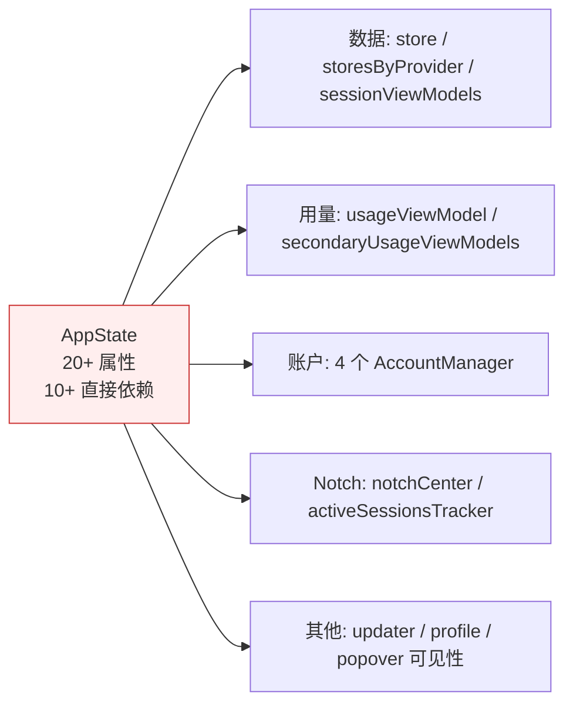
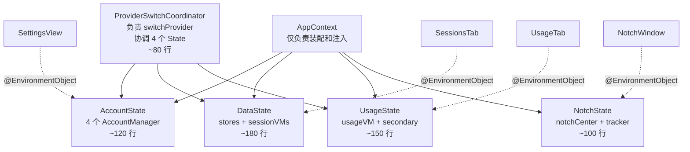
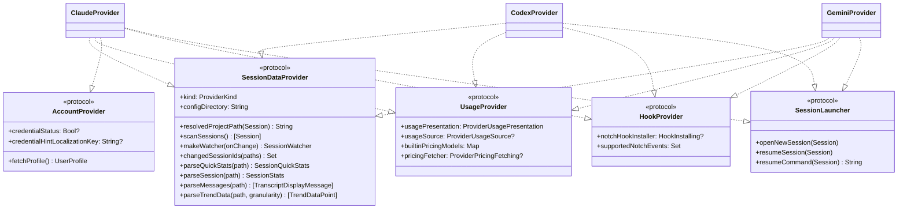
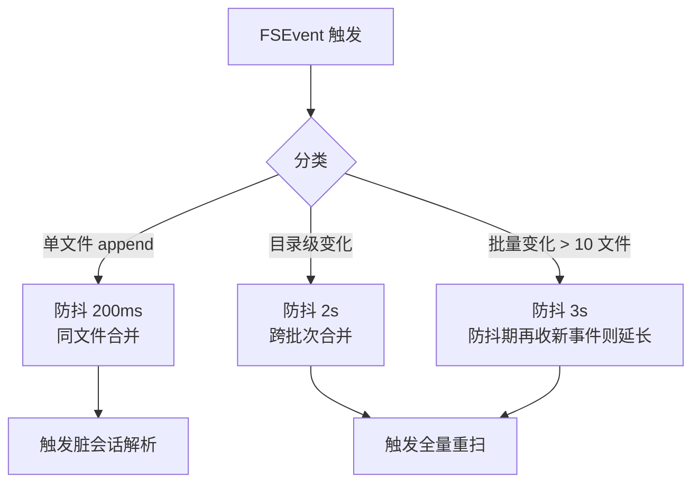
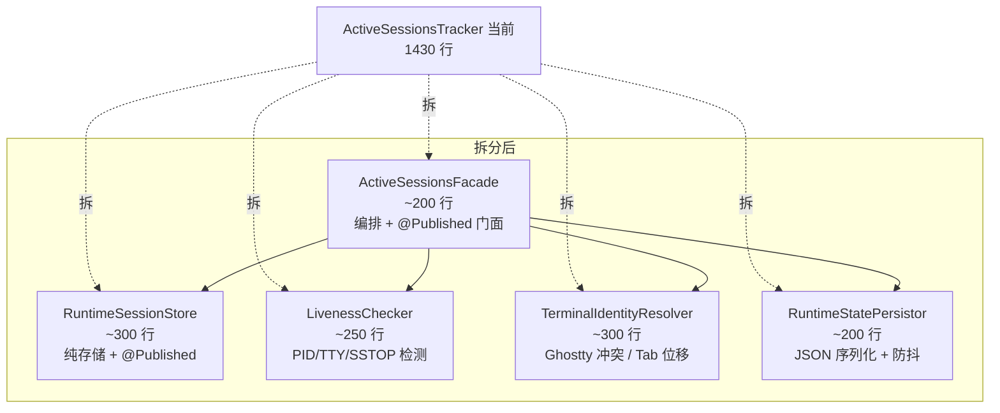
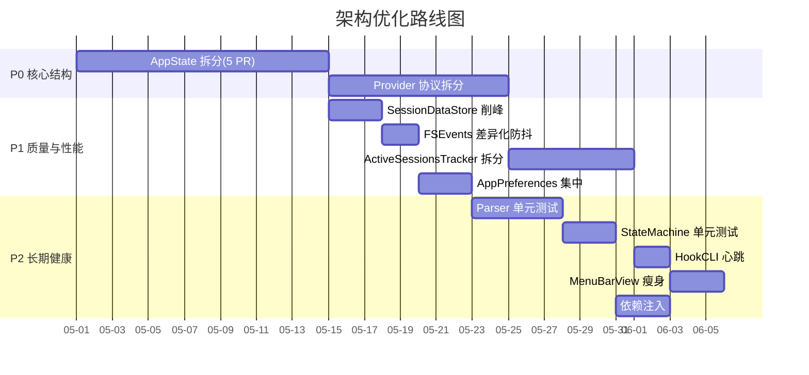
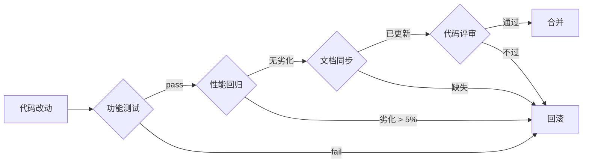

# Claude Statistics 架构评估与优化建议

> 最后更新：2026-04-24
> 覆盖版本：v3.1.0
> 评估范围：140 个 Swift 文件（全量代码库）
> 配套文档：[`ARCHITECTURE.md`](./ARCHITECTURE.md)

本文档是对 Claude Statistics 代码库的全面架构评估。基于前面对六大子系统（启动 / 数据层 / Provider / Notch / 终端焦点 / UI）的深入阅读，总结出**9 条亮点**和**10 个优化点**，并为每个优化点给出具体的迁移方案、步骤和验证标准。

## 目录

1. [评估方法与总分](#1-评估方法与总分)
2. [亮点（保持）](#2-亮点保持)
3. [优化点 P0：核心结构](#3-优化点-p0核心结构)
   - 3.1 AppState God Object 拆分
   - 3.2 SessionProvider 协议按能力拆分
4. [优化点 P1：质量与性能](#4-优化点-p1质量与性能)
   - 4.1 SessionDataStore 的 @Published 风暴
   - 4.2 FSEvents 防抖缺差异化
   - 4.3 ActiveSessionsTracker 拆分
   - 4.4 UserDefaults 集中化
5. [优化点 P2：长期健康](#5-优化点-p2长期健康)
   - 5.1 关键路径测试补齐
   - 5.2 HookCLI 阻塞风险
   - 5.3 MenuBarView 瘦身
   - 5.4 依赖注入与可测性
6. [路线图与工作量](#6-路线图与工作量)
7. [附录：重构检查表](#7-附录重构检查表)

---

## 1. 评估方法与总分

### 1.1 维度与权重

按 6 个维度打分（0–5 分，3 分为及格）：

| 维度 | 权重 | 说明 |
|------|-----|------|
| **抽象合理性** | 20% | 协议/接口是否对准领域边界 |
| **模块内聚** | 15% | 单个类/文件职责是否单一 |
| **解耦程度** | 15% | 修改一处影响面多大 |
| **并发正确性** | 10% | 线程/actor 使用是否稳妥 |
| **可测性** | 15% | 核心逻辑能否被单元测试覆盖 |
| **可观察性** | 10% | 出问题时能否定位 |
| **扩展性** | 15% | 新增 Provider/终端/事件的代价 |

### 1.2 评分

| 维度 | 分数 | 简评 |
|------|------|------|
| 抽象合理性 | **4 / 5** | Provider 分层、Focus 路由、状态机都对准了领域；仅 Provider 协议略大 |
| 模块内聚 | **3 / 5** | AppState/ActiveSessionsTracker/SessionDataStore 三处偏大 |
| 解耦程度 | **3.5 / 5** | Provider 间解耦好；但 AppState 是中心节点，变动传导广 |
| 并发正确性 | **4 / 5** | @MainActor 标注规范，`Task.detached` 后 `MainActor.run` 回跳也规矩 |
| 可测性 | **2 / 5** | 缺单元测试；依赖注入没设计 |
| 可观察性 | **3.5 / 5** | DiagnosticLogger 覆盖到位，但缺 App 内诊断面板 |
| 扩展性 | **4 / 5** | 加 Provider/终端都有清晰路径；加 Card 需改 Container |
| **加权平均** | **3.47 / 5** | **中上** |

### 1.3 结论

**整体合理**。骨架决策（Provider 抽象、数据单源、Socket 协议、Focus 路由）都对。主要问题是**"大类综合征"**——随功能增长，几个关键类（AppState、ActiveSessionsTracker、SessionDataStore）承担过多。

**优先级**：先解决 P0（结构性问题），再 P1（性能/质量），P2（长期健康）可在 P0/P1 过程中穿插完成。

---

## 2. 亮点（保持）

以下 9 条是项目的架构基石，新功能开发应**沿用这些模式**。

### ✨ 2.1 双入口二进制

**位置**：`ClaudeStatistics/App/main.swift:1-8`

```swift
if let exitCode = HookCLI.runIfNeeded(arguments: CommandLine.arguments) {
    exit(exitCode)
}
ClaudeStatisticsApp.main()
```

**为什么好**：
- 单一可执行文件、单一签名 → TCC（辅助功能、AppleScript）权限一次授权
- HookCLI 继承主 App 身份，无需再次 prompt
- 部署简单：Hook 脚本里写 `<app-path> --claude-stats-hook-provider X` 即可

**替代方案的缺点**：分离 CLI 二进制 → 每次用户都要重新授权 Accessibility，用户体验崩。

### ✨ 2.2 Provider 的 "per-provider data, shared behavior"

**位置**：`Models/ProviderKind.swift:53-65`（`canonicalToolName` 调度）

三个 Provider 的原始工具名各不相同（`Edit` / `apply_patch` / `replace`），但项目用枚举 switch + 每个 Provider 的别名表统一调度：

```swift
func canonicalToolName(_ raw: String) -> CanonicalToolName? {
    switch self {
    case .claude: return ClaudeToolNames.canonical(raw)
    case .codex:  return CodexToolNames.canonical(raw)
    case .gemini: return GeminiToolNames.canonical(raw)
    }
}
```

**为什么好**：加新 Provider 只改自己的文件 + `switch` 的一个分支，永远不会有共享代码里漂浮的 `case "apply_patch":`。

### ✨ 2.3 fiveMinSlices 单一数据源

**位置**：`Models/Session.swift:112-133`

```swift
var hourSlices: [Date: DaySlice] {
    // 从 fiveMinSlices 推导
}
var daySlices: [Date: DaySlice] {
    // 从 fiveMinSlices 推导
}
```

**为什么好**：小时、日粒度都从 5 分钟桶派生，不存在"小时对不上 5 分钟"的情况。持久化也只写一份。

### ✨ 2.4 SQLite + FTS5 原子事务

**位置**：`Services/DatabaseService.swift:289-354`

`stats_json` + FTS 索引在同一事务里写入，失败回滚。避免"有统计但搜不到"或"FTS 有残留但 stats 缺失"的半状态。

### ✨ 2.5 NotchStateMachine 的 expandedViaHover 标记

**位置**：`NotchNotifications/UI/NotchStateMachine.swift`

区分两类展开：
- 用户悬停（expandedViaHover=true）→ 鼠标移开立即收起
- 事件驱动（expandedViaHover=false）→ 用户必须主动关闭

**为什么好**：一个布尔解决了"误悬停导致通知消失"这个设计难题。

### ✨ 2.6 Socket 双向阻塞协议

**位置**：`NotchNotifications/Core/AttentionBridge.swift` + `HookCLI/HookCLI.swift:77-154`

```
Permission request: 阻塞 280s 等用户决策
其他事件:          2s 内完成即可
```

**为什么好**：
- 比 NSDistributedNotification 简单（有响应通道）
- 比 XPC 轻量（无需 launchd 配置、无需 MachService）
- 天然本地鉴权（token 文件权限 0o600）

### ✨ 2.7 焦点回归分层（Route → Handler → Focuser）

**位置**：`TerminalFocus/`

```
Route（5 种）→ Handler（5 个）→ Focuser 链
   .appleScript   AppleScriptHandler   AppleScript → Accessibility → Activate
   .cli(.kitty)   CLIHandler           KittyFocuser → Accessibility → Activate
   ...
```

**为什么好**：每层可独立替换；新增终端只需实现 `TerminalCapability` 并注册路由。

### ✨ 2.8 secondaryUsageViewModels 后台保活

**位置**：`App/ClaudeStatisticsApp.swift:97-103, 114-135`

当前 Provider 用主 `UsageViewModel`；其他 Provider 各有一个 `secondaryUsageViewModels[kind]` 后台维持刷新。菜单栏 3 秒轮转的 `MenuBarUsageStrip` 因此能拿到所有 Provider 的最新数据。

**为什么好**：解决了"单 VM 只能服务一个 Provider"与"UI 需同时展示多 Provider"的矛盾，策略清晰。

### ✨ 2.9 解析并行 8 路 + DB 写串行

**位置**：`Services/SessionDataStore.swift:192-248`

CPU 密集的解析在 8 个并行 Task 里跑，DB 写入收敛到单一串行队列。既用满 CPU 又避免 SQLite 锁争用。

---

## 3. 优化点 P0：核心结构

这两个问题**阻塞后续所有优化**（加测试、加 DI、拆子 VM 都依赖它们先解决），建议最先处理。

---

### 3.1 AppState God Object 拆分

#### 现状

**位置**：`App/ClaudeStatisticsApp.swift:26-104`（AppState 类 ~560 行总量）

```swift
final class AppState: ObservableObject {
    @Published private(set) var providerKind: ProviderKind
    @Published private(set) var store: SessionDataStore
    @Published private(set) var sessionViewModel: SessionViewModel
    @Published private(set) var isPopoverVisible = false
    @Published private(set) var secondaryUsageViewModels: [ProviderKind: UsageViewModel] = [:]

    let usageViewModel = UsageViewModel()
    let profileViewModel = ProfileViewModel()
    let updaterService = UpdaterService()
    let notchCenter = NotchNotificationCenter()
    lazy var activeSessionsTracker = ActiveSessionsTracker()
    let claudeAccountManager = ClaudeAccountManager()
    let independentClaudeAccountManager = IndependentClaudeAccountManager()
    let codexAccountManager = CodexAccountManager()
    let geminiAccountManager = GeminiAccountManager()

    private var storesByProvider: [ProviderKind: SessionDataStore] = [:]
    private var sessionViewModelsByProvider: [ProviderKind: SessionViewModel] = [:]
    // ... 300+ 行方法
}
```

#### 问题



1. **每个 @Published 变更都触发所有 `@ObservedObject appState` 的 View 重算**
   - 例如 `isPopoverVisible` 变化时，连 Settings View 都会重绘
2. **单元测试困难**：无法 mock 局部（比如只想测"切换 Provider 时 usageViewModel 的行为"，也得构造全部账户 manager）
3. **修改一个领域要扫整个文件**：改"Provider 切换"要 scroll 到 AppState，但视觉干扰是一堆无关字段
4. **启动顺序脆弱**：`init()` 里 60+ 行依次构造，改动顺序容易引入隐藏 bug

#### 改进方案

按**领域边界**拆成 4 个独立 ObservableObject，通过 `@EnvironmentObject` 注入：



**拆分后接口示例**：

```swift
// AccountState.swift
@MainActor
final class AccountState: ObservableObject {
    let claudeAccountManager: ClaudeAccountManager
    let independentClaudeAccountManager: IndependentClaudeAccountManager
    let codexAccountManager: CodexAccountManager
    let geminiAccountManager: GeminiAccountManager

    init(
        claude: ClaudeAccountManager = .init(),
        claudeIndependent: IndependentClaudeAccountManager = .init(),
        codex: CodexAccountManager = .init(),
        gemini: GeminiAccountManager = .init()
    ) { ... }

    func manager(for kind: ProviderKind) -> AccountManaging { ... }
}

// DataState.swift
@MainActor
final class DataState: ObservableObject {
    @Published private(set) var providerKind: ProviderKind
    @Published private(set) var store: SessionDataStore
    @Published private(set) var sessionViewModel: SessionViewModel
    private var storesByProvider: [ProviderKind: SessionDataStore]
    private var sessionViewModelsByProvider: [ProviderKind: SessionViewModel]
    // 只管数据层,不碰账户/Notch
}

// UsageState.swift
@MainActor
final class UsageState: ObservableObject {
    let usageViewModel: UsageViewModel
    @Published var secondaryUsageViewModels: [ProviderKind: UsageViewModel] = [:]
}

// NotchState.swift
@MainActor
final class NotchState: ObservableObject {
    let notchCenter: NotchNotificationCenter
    let activeSessionsTracker: ActiveSessionsTracker
}

// ProviderSwitchCoordinator.swift
@MainActor
final class ProviderSwitchCoordinator {
    private let accountState: AccountState
    private let dataState: DataState
    private let usageState: UsageState

    func switchProvider(to kind: ProviderKind) {
        dataState.switchProvider(to: kind)
        usageState.swapActiveUsageVM(to: kind)
        // account state 不需要切换，就是全量持有
    }
}
```

**App 入口装配**：

```swift
@main
struct ClaudeStatisticsApp: App {
    @StateObject private var accountState = AccountState()
    @StateObject private var dataState   = DataState()
    @StateObject private var usageState  = UsageState()
    @StateObject private var notchState  = NotchState()
    private let coordinator = ProviderSwitchCoordinator(...)

    var body: some Scene {
        WindowGroup {
            MenuBarView()
                .environmentObject(accountState)
                .environmentObject(dataState)
                .environmentObject(usageState)
                .environmentObject(notchState)
        }
    }
}
```

#### 迁移步骤

分 5 个 PR，每个 PR 都可独立合并、独立回滚：

| PR | 内容 | 风险 |
|----|------|------|
| **PR-1** | 新建 4 个 State 类空壳 + `AppContext` 装配器，AppState 暂时委托给它们 | 零风险，纯新增 |
| **PR-2** | 把 AccountManager 4 个迁到 `AccountState`，View 改用 `@EnvironmentObject AccountState` | 中（账户相关 View 都要改） |
| **PR-3** | 把 store/sessionVM 迁到 `DataState`，`switchProvider` 抽到 `ProviderSwitchCoordinator` | 高（核心路径） |
| **PR-4** | 把 usageViewModel / secondary 迁到 `UsageState` | 中 |
| **PR-5** | 把 notchCenter / tracker 迁到 `NotchState`，删除 AppState | 低（收尾） |

每个 PR 合并前：**全功能回归测试**（启动、切换 Provider、登录 Claude、权限请求、焦点回归、升级）。

#### 验证标准

- ✅ `AppState.swift` 被删除
- ✅ 4 个 State 文件各自 < 200 行
- ✅ 任意 State 可以单独 new 出来不依赖其他
- ✅ 加一个 `AccountStateTests.swift`（mock AccountManager 验证切换逻辑）
- ✅ 性能：启动时间不变、切换 Provider 延迟不变

#### 风险

- **SwiftUI 环境对象传递**：部分 View 可能埋在很深的层级，需要检查所有 `appState.xxx` 引用是否都改对
- **启动顺序依赖**：原 AppState.init 里 `storesByProvider` 先构造再传给 `usageViewModel`；新架构下 `UsageState` 依赖 `DataState` 先初始化好——需要在 `AppContext` 里严格排序

---

### 3.2 SessionProvider 协议按能力拆分

#### 现状

**位置**：`Providers/SessionProvider.swift:213-266`

```swift
protocol SessionProvider: Sendable {
    var kind: ProviderKind { get }
    var displayName: String { get }
    var capabilities: ProviderCapabilities { get }
    var usagePresentation: ProviderUsagePresentation { get }
    var usageSource: (any ProviderUsageSource)? { get }
    var configDirectory: String { get }
    var credentialStatus: Bool? { get }
    var statusLineInstaller: (any StatusLineInstalling)? { get }
    var notchHookInstaller: (any HookInstalling)? { get }
    var supportedNotchEvents: Set<NotchEventKind> { get }
    var builtinPricingModels: [String: ModelPricing.Pricing] { get }
    var pricingFetcher: (any ProviderPricingFetching)? { get }
    var pricingSourceLocalizationKey: String? { get }
    var pricingSourceURL: URL? { get }
    var pricingUpdatedLocalizationKey: String? { get }
    var credentialHintLocalizationKey: String? { get }
    var alwaysRescanOnFileChanges: Bool { get }

    func resolvedProjectPath(for session: Session) -> String
    func scanSessions() -> [Session]
    func makeWatcher(onChange: @escaping (Set<String>) -> Void) -> (any SessionWatcher)?
    func changedSessionIds(for changedPaths: Set<String>) -> Set<String>
    func shouldRescanSessions(for changedPaths: Set<String>) -> Bool
    func parseQuickStats(at path: String) -> SessionQuickStats
    func parseSession(at path: String) -> SessionStats
    func parseMessages(at path: String) -> [TranscriptDisplayMessage]
    func parseSearchIndexMessages(at path: String) -> [SearchIndexMessage]
    func parseTrendData(from filePath: String, granularity: TrendGranularity) -> [TrendDataPoint]
    func openNewSession(_ session: Session)
    func resumeSession(_ session: Session)
    func openNewSession(inDirectory path: String)
    func resumeCommand(for session: Session) -> String
    func fetchProfile() async -> UserProfile?
}
```

**17 个属性 + 12 个方法 = 29 个成员**。

#### 问题

1. **单一协议承担多个能力**：数据扫描、解析、终端启动、定价、状态栏、Hook 全混在一起
2. **Gemini 没有账户概念**，但 `fetchProfile() async -> UserProfile?` 仍要实现（返回 nil）
3. **Codex 没有 OAuth**，但相关属性仍要应付
4. **消费方拿到过大的协议**：一个只想读取用量的 VM 也被强迫知道"这个 Provider 如何启动新会话"

#### 改进方案

按**能力**拆成 5 个窄协议，具体 Provider 用扩展组合：



**保留一个统一门面** `SessionProvider` 作为 `SessionDataProvider & UsageProvider & ... ` 的 typealias 或合集协议：

```swift
typealias SessionProvider = SessionDataProvider & UsageProvider & HookProvider & SessionLauncher
// 注意：AccountProvider 不在这里，因为 Codex/Gemini 不实现
```

**消费方按需窄化**：

```swift
// 之前
final class UsageViewModel {
    var store: SessionDataStore?  // 里面的 provider 是 SessionProvider（29 个成员）
    func refresh() {
        guard let source = store?.provider.usageSource else { return }
        // 被迫知道 provider 其他 20 多个属性存在
    }
}

// 之后
final class UsageViewModel {
    var usageProvider: UsageProvider?  // 仅 4 个成员
    func refresh() {
        guard let source = usageProvider?.usageSource else { return }
    }
}
```

#### 迁移步骤

| 步骤 | 内容 |
|------|------|
| 1 | 定义 5 个新协议文件，**不改** `SessionProvider`（保持向后兼容） |
| 2 | 把 `SessionProvider` 改成 `typealias SessionProvider = SessionDataProvider & UsageProvider & HookProvider & SessionLauncher`（`AccountProvider` 独立） |
| 3 | 各 Provider 类声明改成 `final class ClaudeProvider: SessionDataProvider, UsageProvider, AccountProvider, HookProvider, SessionLauncher` |
| 4 | Gemini/Codex 删掉不必要的 `fetchProfile` 伪实现 |
| 5 | 逐个消费方窄化参数类型（可分多个小 PR） |

#### 验证标准

- ✅ `GeminiProvider` 不再符合 `AccountProvider`
- ✅ `UsageViewModel` 只依赖 `UsageProvider`（编辑器里按 `.` 只出现 usage 相关属性）
- ✅ 所有原有测试（如果有的话）通过
- ✅ 编译器类型检查替你防呆：某 Provider 没实现 `AccountProvider` 就编译失败

#### 风险

- **泛型复杂度升高**：部分容器（如 `ProviderRegistry`）可能需要存 `any SessionDataProvider & ...`，类型签名变长
- **两步走**比一步切更稳：先定义窄协议、先让现有代码继续用 `SessionProvider` 总协议，消费方按需迁移

---

## 4. 优化点 P1：质量与性能

### 4.1 SessionDataStore 的 @Published 风暴

#### 现状

**位置**：`Services/SessionDataStore.swift`（1219 行）

`SessionDataStore` 有 5 个 @Published 属性：

```swift
@Published var sessions: [Session]
@Published var quickStats: [String: SessionQuickStats]
@Published var parsedStats: [String: SessionStats]
@Published var periodStats: [PeriodStats]
@Published var visibleStats: [PeriodStats]
```

批处理 8 个会话解析时，会依次更新 `parsedStats` → `periodStats` → `visibleStats`，每次更新都触发所有订阅 View 的 rerender。

#### 问题

假设当前 Panel 打开、Stats Tab 可见：

```
Time    Action                                  Views Redrawn
----------------------------------------------------------
T+0ms   parse batch done                        -
T+1ms   parsedStats[id1] = stats                SessionListView + StatsView (×1)
T+2ms   parsedStats[id2] = stats                SessionListView + StatsView (×2)
...
T+8ms   8 个 parsedStats 全部写完               SessionListView + StatsView (×8)
T+9ms   periodStats = rebucket()                StatsView (×9)
T+10ms  visibleStats = filter(periodStats)      StatsView (×10)
```

**10 次 rerender**（其中 SessionListView 中的 8 次是无意义的——它不关心 periodStats）。

#### 改进方案

**方案 A**（最简，零结构变更）：用 `objectWillChange` 手动节流

```swift
// 之前
for session in batch {
    parsedStats[session.id] = stats  // 每次都触发 objectWillChange
}
rebucketPeriodStats()

// 之后
objectWillChange.send()            // 批次开始前发一次
for session in batch {
    // 关闭单个字段的 publisher
    _parsedStats.wrappedValue[session.id] = stats
}
_periodStats.wrappedValue = rebucketPeriodStats()
_visibleStats.wrappedValue = filter(...)
// 批次结束,下一次 RunLoop 统一重绘（1 次而非 10 次）
```

注意：`_parsedStats.wrappedValue = ...` 这种写法需要 @Published 的 projected value 访问。

**方案 B**（推荐）：改为事务性快照

```swift
struct SessionDataSnapshot {
    let sessions: [Session]
    let quickStats: [String: SessionQuickStats]
    let parsedStats: [String: SessionStats]
    let periodStats: [PeriodStats]
    let visibleStats: [PeriodStats]
    let version: Int
}

@MainActor
final class SessionDataStore: ObservableObject {
    @Published private(set) var snapshot: SessionDataSnapshot

    func applyBatch(_ updates: [SessionStats]) {
        // 全部改动收在一个 snapshot 里
        var next = snapshot
        for stats in updates { next.parsedStats[stats.sessionId] = stats }
        next.periodStats = rebucket(from: next.parsedStats)
        next.visibleStats = filter(next.periodStats)
        snapshot = next  // 一次 publish
    }
}
```

消费方用 key path 订阅：

```swift
store.$snapshot.map(\.sessions).removeDuplicates()   // 只在 sessions 真变时触发
```

**方案 C**（最重）：用 Combine `.throttle`

```swift
$parsedStats
    .throttle(for: .milliseconds(100), scheduler: RunLoop.main, latest: true)
    .sink { _ in /* 触发 View */ }
```

不推荐：会引入延迟且不够精确。

#### 推荐

**方案 B**（快照模式）。虽然改动最大，但一次到位；订阅端用 key path 自然去重。预计工时 3 天。

#### 验证

- ✅ 打开 Instruments → SwiftUI，确认一次批处理后 View body 的调用次数 ≤ 2
- ✅ Stats Tab 切到 Sessions Tab 时切换延迟 < 100ms

---

### 4.2 FSEvents 防抖缺差异化

#### 现状

**位置**：`Services/FSEventsWatcher.swift:1-110`

```
C 层延迟:     0.5s
Swift 层防抖: 2.0s
合计延迟:     2.5s
```

所有文件变化（单文件 append / 目录结构变化 / 批量删除）用同一配置。

#### 问题

用户体验视角：

| 场景 | 当前延迟 | 合理延迟 | 体感 |
|------|---------|---------|------|
| 刚发完一条消息，CLI 写了几百字节到 jsonl | 2.5s | 200ms | **迟钝** |
| `git checkout` 切分支导致一批文件变化 | 2.5s | 3-5s | 恰好（避免高频重扫） |
| 删除一个会话目录 | 2.5s | 1s | 慢 |

#### 改进方案

按事件类型差异化防抖：



**实现要点**：

```swift
private var fastDebouncer = Debouncer(interval: 0.2)
private var slowDebouncer = Debouncer(interval: 2.0)

func handleEvents(_ events: [FSEvent]) {
    let grouped = classify(events)
    if grouped.singleFileAppends.count > 0 {
        fastDebouncer.call { [weak self] in
            self?.emitChangedSessions(from: grouped.singleFileAppends)
        }
    }
    if grouped.structuralChanges.count > 0 {
        slowDebouncer.call { [weak self] in
            self?.emitRescan()
        }
    }
}
```

#### 风险

- **分类算法**：怎么判断"单文件 append"vs"文件重写"？需要看 FSEvent 的 flags
- 预计工时 2 天（含分类算法打磨）

#### 验证

- ✅ 开着 Panel，终端里发一条消息，3 秒内 Session List 看到新数据
- ✅ `git checkout` 切大分支，不会触发 10 次解析

---

### 4.3 ActiveSessionsTracker 拆分

#### 现状

**位置**：`NotchNotifications/Core/ActiveSessionsTracker.swift`（**1430 行**）

一个文件同时承担：
1. 运行时状态存储（RuntimeSession 字典）
2. Hook 事件摄入与状态更新
3. PID liveness 检测
4. Ctrl+Z 检测（`proc_pidinfo + SSTOP`）
5. Codex 特殊的 post-stop 验证
6. Ghostty 终端 ID 冲突解决
7. Tab 位移（新 SessionStart 顶掉旧会话）
8. JSON 持久化（防抖写盘）
9. App 重启后的合并恢复
10. `@Published activeSessions` 发布给 UI

#### 问题

1. **1430 行单文件**，阅读成本高
2. **改动传染面大**：调整 liveness 检测算法也可能影响到持久化逻辑
3. **测试不可能**：想测 SSTOP 检测要连带构造整套 tracker

#### 改进方案

按职责拆 4 个类：



**接口示例**：

```swift
// RuntimeSessionStore.swift
@MainActor
final class RuntimeSessionStore {
    private var sessions: [SessionKey: RuntimeSession] = [:]

    func upsert(_ session: RuntimeSession) { ... }
    func remove(_ key: SessionKey) { ... }
    func snapshot() -> [RuntimeSession] { ... }
}

// LivenessChecker.swift
struct LivenessChecker {
    func isAlive(pid: Int32) -> Bool { ... }
    func isSuspended(pid: Int32) -> Bool { /* SSTOP check */ ... }
    func postStopVerify(pid: Int32) async -> Bool { /* 250ms + recheck */ ... }
}

// TerminalIdentityResolver.swift
struct TerminalIdentityResolver {
    func resolveGhosttyCollision(
        existing: [RuntimeSession],
        incoming: HookEvent
    ) -> IdentityResolution { ... }

    func findDisplacedSessions(
        in tab: TerminalTabKey,
        by newStart: HookEvent
    ) -> [SessionKey] { ... }
}

// RuntimeStatePersistor.swift
actor RuntimeStatePersistor {
    func persist(_ snapshot: [RuntimeSession]) async { ... }
    func load() async -> [RuntimeSession] { ... }
}

// ActiveSessionsFacade.swift
@MainActor
final class ActiveSessionsFacade: ObservableObject {
    @Published private(set) var activeSessions: [ActiveSession] = []

    private let store: RuntimeSessionStore
    private let liveness: LivenessChecker
    private let resolver: TerminalIdentityResolver
    private let persistor: RuntimeStatePersistor

    func record(_ event: HookEvent) async { ... }  // 只做编排
}
```

#### 迁移步骤

分 4 个 PR：

1. 先抽出 `RuntimeStatePersistor`（无状态、易抽）
2. 再抽 `LivenessChecker`（纯函数、易测）
3. 再抽 `TerminalIdentityResolver`（有状态但逻辑孤立）
4. 最后把剩下的 `ActiveSessionsTracker` 重命名为 `ActiveSessionsFacade`

#### 验证

- ✅ 每个类 < 400 行
- ✅ `LivenessChecker` 有单元测试（mock proc_pidinfo）
- ✅ Notch 现有所有行为完全不变（手工测试 checklist）

---

### 4.4 UserDefaults 集中化

#### 现状

**分散在十几个文件里的 UserDefaults key**（举例）：

```swift
// ClaudeAccountModeController.swift
UserDefaults.standard.object(forKey: "claudeAccountSyncMode")

// NotchPreferences.swift
UserDefaults.standard.bool(forKey: "notch.enabled.\(provider.rawValue)")
UserDefaults.standard.bool(forKey: "notch.sound.enabled")
UserDefaults.standard.string(forKey: "notch.sound.name")

// 各 View
@AppStorage("fontScale") var fontScale: Double = 1.0
@AppStorage("appLanguage") var lang: String = "system"
@AppStorage("autoRefreshEnabled") var autoRefresh: Bool = true
```

全项目 `grep UserDefaults.standard\|@AppStorage` 估计 50+ 处。

#### 问题

1. **Key 没有 single source of truth**：不知道 App 总共有多少偏好
2. **类型不安全**：`object(forKey:) as? Bool` 拿到的可能是 nil，容易漏 fallback
3. **重构成本高**：改名要全文搜字符串
4. **默认值散落**：`DefaultSettings.register()` 里注册一批默认，但各 `@AppStorage` 又有各自的 default，容易冲突

#### 改进方案

集中到 `AppPreferences` 命名空间：

```swift
// AppPreferences.swift
enum AppPreferences {
    // Claude 账户
    @Key("claudeAccountSyncMode", default: false)
    static var claudeSyncMode: Bool

    // Notch
    @Key("notch.sound.enabled", default: true)
    static var notchSoundEnabled: Bool

    @Key("notch.sound.name", default: "Hero")
    static var notchSoundName: String

    // UI
    @Key("fontScale", default: 1.0)
    static var fontScale: Double

    @Key("appLanguage", default: "system")
    static var appLanguage: String

    @Key("autoRefreshEnabled", default: true)
    static var autoRefreshEnabled: Bool

    // 需要参数的动态 key
    static func notchEnabled(for provider: ProviderKind) -> Bool {
        UserDefaults.standard.bool(forKey: "notch.enabled.\(provider.rawValue)")
    }
    static func setNotchEnabled(_ value: Bool, for provider: ProviderKind) {
        UserDefaults.standard.set(value, forKey: "notch.enabled.\(provider.rawValue)")
    }
}

// 自定义 property wrapper
@propertyWrapper
struct Key<T> {
    let key: String
    let defaultValue: T

    var wrappedValue: T {
        get { UserDefaults.standard.object(forKey: key) as? T ?? defaultValue }
        set { UserDefaults.standard.set(newValue, forKey: key) }
    }
}
```

**使用方改造**：

```swift
// 之前
UserDefaults.standard.bool(forKey: "notch.sound.enabled")

// 之后
AppPreferences.notchSoundEnabled
```

#### 迁移步骤

分阶段，每个 PR 聚焦一个领域：
1. PR-1：创建 `AppPreferences.swift`，先只放 5-10 个 key
2. PR-2：迁移 Notch 相关 key
3. PR-3：迁移 UI 相关 key（字体/语言）
4. PR-4：迁移账户相关
5. PR-5：删除 `DefaultSettings.register()`

#### 验证

- ✅ `grep -r "UserDefaults.standard" Src/` 只出现在 `AppPreferences.swift`
- ✅ `grep -r "@AppStorage" Views/` 只出现在使用 AppPreferences 的 key 字符串（可选：用 `@AppStorage(AppPreferences.Keys.fontScale)` 这种 enum key）

---

## 5. 优化点 P2：长期健康

### 5.1 关键路径测试补齐

#### 现状

- 项目根目录：`find . -name '*Tests*'` 基本为空
- 关键纯逻辑（parser / state machine / normalizer）无测试覆盖

#### 影响

- 重构时无法验证行为不变
- Provider 格式升级（比如 Codex 改 JSONL 结构）只能靠手工测试
- 新人改代码心里没底

#### 建议优先覆盖的模块

| 模块 | 行数 | 为什么优先 | 预计测试代码行数 |
|------|------|-----------|-----------------|
| **TranscriptParser** | ~600 | 纯函数、输入输出明确、业务核心 | ~300 |
| **CodexTranscriptParser** | ~500 | 同上 | ~250 |
| **GeminiTranscriptParser** | ~400 | 同上 | ~200 |
| **NotchStateMachine** | ~250 | 状态表驱动、边界条件多 | ~150 |
| **ClaudeHookNormalizer** | ~200 | 事件映射、易断言 | ~100 |
| **ShareRoleEngine** | ~300 | 评分算法、易回归 | ~150 |

#### 做法

1. 创建 `ClaudeStatisticsTests/` 目录 + `project.yml` 加 test target
2. 每个模块：
   - 建 `Fixtures/` 目录存真实 JSONL 片段（匿名化）
   - 断言格式：`XCTAssertEqual(parser.parseSession(fixture).totalTokens, 12345)`
3. CI：`xcodebuild test` 跑一遍

#### 验证

- ✅ `xcodebuild test` 通过
- ✅ 关键 parser 覆盖率 > 70%

---

### 5.2 HookCLI 阻塞风险

#### 现状

**位置**：`HookCLI/HookCLI.swift:111-154`

```swift
SO_RCVTIMEO = 280s  // permission request
SO_RCVTIMEO = 2s    // 其他事件
```

**场景**：用户收到 permission request，此时关闭主 App，HookCLI 在 socket 上阻塞读 280 秒，CLI 进程挂住。

#### 改进方案

**方案 A**：主 App 死亡时 SIGTERM 所有活跃 HookCLI

```swift
// 主 App 端
class AttentionBridge {
    private var activeHookCLIs: Set<pid_t> = []

    func handleConnection(fd: Int32, from pid: pid_t) {
        activeHookCLIs.insert(pid)
        // ...
    }
}

// applicationWillTerminate
for pid in activeHookCLIs {
    kill(pid, SIGTERM)
}
```

**方案 B**（更稳）：HookCLI 心跳检测

```swift
// HookCLI 端
let heartbeatTask = Task {
    while !Task.isCancelled {
        try await Task.sleep(for: .seconds(5))
        if !isMainAppAlive() {
            exit(2)  // 主 App 死了，不等了
        }
    }
}

func isMainAppAlive() -> Bool {
    // 通过 PID 或 Bundle 查询
    return NSRunningApplication.runningApplications(
        withBundleIdentifier: "com.tinystone.ClaudeStatistics"
    ).isEmpty == false
}
```

方案 B 更健壮（不依赖 App 优雅退出），方案 A 更简单。建议**先做 A，再考虑 B**。

#### 验证

- ✅ 手动关 App 时 HookCLI 立即退出、CLI 不挂
- ✅ Activity Monitor 确认无僵尸 HookCLI 进程

---

### 5.3 MenuBarView 瘦身

#### 现状

`Views/MenuBarView.swift` 估计 400+ 行，承载：
- 4-Tab 切换逻辑
- 2 个 Banner（更新 + 终端配置）
- Footer
- 多个 Sheet（Share / TerminalSetup）
- 多个 @ObservedObject 绑定

#### 改进方案

**方案**：Tab 用 enum 驱动，View 结构用子容器

```swift
enum AppTab: Hashable, CaseIterable {
    case sessions, stats, usage, settings

    @ViewBuilder
    var view: some View {
        switch self {
        case .sessions: SessionsTabContainer()
        case .stats:    StatsTabContainer()
        case .usage:    UsageTabContainer()
        case .settings: SettingsTabContainer()
        }
    }

    var icon: String { ... }
    var titleKey: String { ... }
}

struct MenuBarView: View {
    @State private var tab: AppTab = .sessions

    var body: some View {
        VStack {
            TabBarView(selection: $tab)
            BannersContainer()
            tab.view        // 自动切换
            FooterView()
        }
    }
}
```

每个 `*TabContainer` 独立文件，< 200 行。

#### 验证

- ✅ `MenuBarView.swift` < 200 行
- ✅ 视觉和交互完全不变

---

### 5.4 依赖注入与可测性

#### 现状

`AppState.init()` 里全是硬构造：

```swift
let claudeAccountManager = ClaudeAccountManager()
let codexAccountManager = CodexAccountManager()
// ...
```

无法注入 mock → 单元测试困难。

#### 改进方案

构造器参数带默认值：

```swift
final class AccountState: ObservableObject {
    let claudeAccountManager: any ClaudeAccountManaging
    let codexAccountManager: any CodexAccountManaging
    let geminiAccountManager: any GeminiAccountManaging

    init(
        claudeAccountManager: any ClaudeAccountManaging = ClaudeAccountManager(),
        codexAccountManager: any CodexAccountManaging = CodexAccountManager(),
        geminiAccountManager: any GeminiAccountManaging = GeminiAccountManager()
    ) {
        self.claudeAccountManager = claudeAccountManager
        self.codexAccountManager = codexAccountManager
        self.geminiAccountManager = geminiAccountManager
    }
}

// 测试里
let mock = MockClaudeAccountManager()
let state = AccountState(claudeAccountManager: mock)
```

生产代码零改动（默认值），测试代码得到可注入点。

#### 验证

- ✅ `AccountStateTests.swift` 能用 mock 构造 AccountState
- ✅ 3 个 AccountManager 都有对应的协议 `*Managing`

---

## 6. 路线图与工作量

### 6.1 甘特图



### 6.2 工作量估算（单人）

| 任务 | 天数 | 风险 |
|------|------|------|
| 3.1 AppState 拆分 | 10 | 中（SwiftUI 环境对象传递） |
| 3.2 Provider 协议拆分 | 7 | 低（类型系统护航） |
| 4.1 SessionDataStore 削峰 | 3 | 低 |
| 4.2 FSEvents 差异化 | 2 | 中（分类算法需打磨） |
| 4.3 ActiveSessionsTracker 拆分 | 7 | 中（行为保持） |
| 4.4 UserDefaults 集中 | 3 | 低 |
| 5.1 测试补齐 | 8 | 低 |
| 5.2 HookCLI 心跳 | 2 | 低 |
| 5.3 MenuBarView 瘦身 | 3 | 低 |
| 5.4 依赖注入 | 3 | 低 |
| **合计** | **48 天** | 约 2.5 月单人工作量 |

### 6.3 建议节奏

- **第 1 个月**：P0（AppState + Provider 协议）→ 最具结构价值，打好地基
- **第 2 个月**：P1（SessionDataStore + FSEvents + ActiveSessionsTracker + UserDefaults）→ 收获质量与性能红利
- **第 3 个月**：P2（测试 + 心跳 + MenuBarView + DI）→ 长期健康投入

每个 PR 必须：
1. **保持功能等价**（有手工测试 checklist）
2. **可独立回滚**（commit 历史清晰）
3. **文档更新**（`ARCHITECTURE.md` 同步）

---

## 7. 附录：重构检查表

### 7.1 每个 PR 的 Done Criteria



**功能测试 Checklist**（每次 PR 必跑）：
- [ ] 启动 App → 菜单栏图标出现
- [ ] 点击图标 → 面板打开
- [ ] 切换 4 个 Tab → 内容正常
- [ ] 切换 Provider（Claude → Codex → Gemini）→ 数据刷新
- [ ] 打开一个会话详情 → 统计显示
- [ ] 打开 Transcript → 消息渲染
- [ ] 搜索一个关键词 → FTS 返回结果
- [ ] 打开 Settings → 6 个子面板展开
- [ ] Claude 登录（Independent 模式）→ OAuth 成功
- [ ] 触发一次 Permission Request → Notch 弹出
- [ ] 点击 Allow → CLI 继续执行
- [ ] 点击 Notch 会话 → 焦点回到终端
- [ ] 生成一张分享卡片 → PNG 导出

### 7.2 性能基线

重构前后对比以下指标（用 Instruments 记录）：

| 指标 | 当前（基线） | 红线（劣化警报） |
|------|-------------|-----------------|
| 启动到菜单栏可点击 | ~1.5s | > 2s |
| 面板打开延迟 | ~300ms | > 500ms |
| 切换 Provider 延迟 | ~500ms | > 1s |
| Permission Request Notch 显示延迟 | ~200ms | > 400ms |
| 内存（空闲） | ~80 MB | > 120 MB |
| 内存（打开 Panel + 1000 会话） | ~250 MB | > 400 MB |

### 7.3 代码度量目标

| 维度 | 当前 | 目标 |
|------|------|------|
| 单文件最大行数 | 1430（ActiveSessionsTracker） | < 500 |
| AppState 行数 | 563 | 0（已拆） |
| 无测试覆盖的核心模块 | 6 | 0 |
| 分散的 UserDefaults 键 | ~50 处调用 | 集中到 1 个文件 |
| Provider 协议成员数 | 29 | 每个窄协议 < 10 |

---

**文档终**。每个优化点都可以作为独立任务推进，建议从 P0 开始、每个 PR 小而专注。

有疑问或想先动某一块，再来细化具体 PR 方案。
