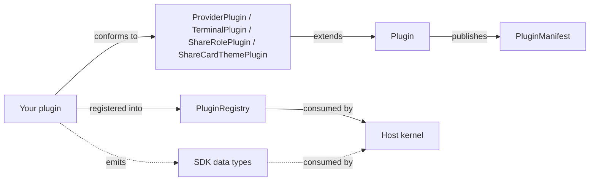

# Claude Statistics Plugin Development Guide

> v4.0-alpha · Last updated 2026-04-26
> SDK package: `ClaudeStatisticsKit` (linked target inside this repo at
> `Plugins/Sources/ClaudeStatisticsKit/`)
> Companion docs: [`REWRITE_PLAN.md`](./REWRITE_PLAN.md) (architecture)

This guide describes how to write a plugin for Claude Statistics. The
plugin model lets you contribute a new AI coding CLI provider, a new
terminal-emulator adapter, a share-card role set, or a share-card
visual theme — all without modifying the host app's source code.

> **Status**: v4.0-alpha. The full SDK protocol surface is in place —
> all 5 narrow capability protocols (`SessionDataProvider` /
> `SessionLauncher` / `UsageProvider` / `HookProvider` /
> `AccountProvider`) plus their support types (`HookInstalling` /
> `ProviderUsageSource` / `ProviderPricingFetching` /
> `ModelPricingRates` / etc.) and the `Session` struct ship in
> `ClaudeStatisticsKit`. Terminal plugins also have a complete focus +
> launch contract (`TerminalFocusStrategy` / `TerminalLauncher`).
>
> Third-party plugins compile against `ClaudeStatisticsKit` only — no
> host coupling. What's still missing for a shippable third-party
> plugin is the loading mechanism: `.csplugin` bundle support lands in
> M2, runtime permission gating in M3. See
> [§"Current limitations"](#current-limitations) for the cleanup list.

---

## Table of contents

1. [Concepts](#1-concepts)
2. [Project setup](#2-project-setup)
3. [PluginManifest reference](#3-pluginmanifest-reference)
4. [Hello-world plugin](#4-hello-world-plugin)
5. [Provider plugin](#5-provider-plugin)
6. [Terminal plugin](#6-terminal-plugin)
7. [Share-role plugin](#7-share-role-plugin)
8. [Share-card-theme plugin](#8-share-card-theme-plugin)
9. [SDK type reference](#9-sdk-type-reference)
10. [Registration & loading](#10-registration--loading)
11. [Current limitations](#11-current-limitations)
12. [Distribution (today vs M2 vs GA)](#12-distribution-today-vs-m2-vs-ga)

---

## 1. Concepts

A **plugin** is an `AnyObject` conforming to `Plugin` plus one or more
of the four kind-specific refinements:

| Plugin kind | Refines `Plugin` with… | Example |
|---|---|---|
| `.provider` | `ProviderPlugin` (descriptor accessor) | Claude / Codex / Gemini / Aider |
| `.terminal` | `TerminalPlugin` (descriptor + `detectInstalled()`) | iTerm2 / Kitty / Ghostty / Tabby |
| `.shareRole` | `ShareRolePlugin` (`roles: [ShareRoleDescriptor]`) | "Night-Shift Engineer", "Tool Summoner" |
| `.shareCardTheme` | `ShareCardThemePlugin` (`themes: [ShareCardThemeDescriptor]`) | Classic theme, Halloween theme |

Every plugin publishes a static `PluginManifest` (id / version /
permissions / minHostAPIVersion). The host's `PluginLoader` reads the
manifest before instantiation, then registers the plugin against
`PluginRegistry` keyed by `manifest.id`.

Plugins talk to the host purely through the SDK's neutral data types
(`SessionStats`, `UsageData`, `TranscriptDisplayMessage`, …) — they
don't import host source.



---

## 2. Project setup

Until the M3 milestone introduces standalone `.csplugin` bundle
loading, plugins live as targets inside this repository's Xcode project
so they statically link `ClaudeStatisticsKit` and ship together with
the host app.

To author a new plugin today:

1. **Create a Swift target** under `ClaudeStatistics/Providers/` (Provider
   plugin) or `ClaudeStatistics/Terminal/Capabilities/` (Terminal plugin)
   or anywhere convenient.
2. **Import the SDK**: every file in your plugin needs
   ```swift
   import ClaudeStatisticsKit
   ```
   The SDK is already linked into the host target via
   `project.yml`'s `targets.ClaudeStatistics.dependencies`.
3. **Author your `Plugin` subclass** (see §4).
4. **Register it in `AppState.pluginRegistry`** (§10).
5. **Run** `bash scripts/run-debug.sh` to build and verify.

---

## 3. PluginManifest reference

Every plugin must publish a static `manifest`:

```swift
public struct PluginManifest: Codable, Sendable, Equatable {
    public let id: String                       // "com.example.myprovider"
    public let kind: PluginKind                 // .provider / .terminal / .shareRole / .shareCardTheme / .both
    public let displayName: String              // "My Provider"
    public let version: SemVer                  // SemVer(major: 1, minor: 2, patch: 3)
    public let minHostAPIVersion: SemVer        // your floor — host rejects loads below
    public let permissions: [PluginPermission]  // declarative coarse perms
    public let principalClass: String           // "MyProviderPlugin" — host uses for Bundle.load() instantiation
    public let iconAsset: String?               // optional bundle-relative resource (24x24 template PDF)
}
```

### `id` rules

- Reverse-DNS: `com.<vendor>.<plugin-name>` (e.g. `com.anthropic.claude`,
  `net.kovidgoyal.kitty`, `com.example.aider`).
- Globally unique. The host's loader rejects duplicate-id registration.
- For builtin plugins, the `id` matches the legacy `ProviderKind.rawValue`
  so on-disk caches keep loading.

### `permissions`

Coarse, user-facing permission flags shown in the trust prompt when a
third-party plugin is loaded for the first time:

| Value | What it grants |
|---|---|
| `.filesystemHome` | Read/write under `~` |
| `.filesystemAny` | Read/write any path (high-risk; default deny) |
| `.network` | Outbound network |
| `.accessibility` | macOS Accessibility (AX) APIs |
| `.appleScript` | OSA / AppleScript |
| `.keychain` | Security framework / Keychain |

Declare only what you need — over-declaring scares users away.

### `minHostAPIVersion`

Compare against `SDKInfo.apiVersion`. If your plugin uses APIs added in
`0.2.0`, set `minHostAPIVersion = SemVer(major: 0, minor: 2, patch: 0)`.
The host rejects loads where its `SDKInfo.apiVersion < manifest.minHostAPIVersion`.

---

## 4. Hello-world plugin

Minimal Provider plugin (descriptor only — actual session/usage/account
behaviour comes through the still-host-side narrow protocols, see §5):

```swift
import ClaudeStatisticsKit

final class HelloProviderPlugin: ProviderPlugin {
    static let manifest = PluginManifest(
        id: "com.example.hello",
        kind: .provider,
        displayName: "Hello",
        version: SemVer(major: 0, minor: 1, patch: 0),
        minHostAPIVersion: SDKInfo.apiVersion,
        permissions: [.filesystemHome],
        principalClass: "HelloProviderPlugin"
    )

    let descriptor = ProviderDescriptor(
        id: "com.example.hello",
        displayName: "Hello",
        iconAssetName: "ClaudeProviderIcon",  // reuse builtin asset for now
        accentColor: .blue,
        notchEnabledDefaultsKey: "notch.enabled.com.example.hello",
        capabilities: ProviderCapabilities(
            supportsCost: false,
            supportsUsage: false,
            supportsProfile: false,
            supportsStatusLine: false,
            supportsExactPricing: false,
            supportsResume: false,
            supportsNewSession: false
        ),
        resolveToolAlias: { _ in nil }  // no aliases — pass through
    )

    init() {}
}
```

Register it in `AppState`:

```swift
// ClaudeStatistics/App/ClaudeStatisticsApp.swift
let pluginRegistry: PluginRegistry = {
    let registry = PluginRegistry()
    let plugins: [any Plugin] = [
        // ... existing dogfood plugins ...
        HelloProviderPlugin(),
    ]
    for plugin in plugins {
        try? registry.register(plugin)
    }
    return registry
}()
```

Build with `bash scripts/run-debug.sh` — you should see
`PluginRegistry dogfood: providers=4 terminals=8` in the diagnostic
log.

---

## 5. Provider plugin

A Provider plugin contributes a vendor adapter for an AI coding CLI.
Contract:

```swift
public protocol ProviderPlugin: Plugin {
    var descriptor: ProviderDescriptor { get }
}
```

### `ProviderDescriptor`

```swift
public struct ProviderDescriptor: Sendable {
    public let id: String                                     // matches manifest.id
    public let displayName: String
    public let iconAssetName: String                          // template PDF asset name
    public let accentColor: Color                             // SwiftUI.Color
    public let notchEnabledDefaultsKey: String                // "notch.enabled.<id>"
    public let capabilities: ProviderCapabilities             // feature-flag matrix
    public let resolveToolAlias: @Sendable (String) -> String? // raw → canonical
}
```

The `resolveToolAlias` closure is how your provider declares its tool
vocabulary mapping. The host calls it with already-normalized names
(lower-cased, underscores) and expects either a canonical name from
`CanonicalToolName.displayName(for:)`'s vocabulary (`"bash"`, `"edit"`,
`"read"`, `"grep"`, `"glob"`, `"ls"`, `"webfetch"`, `"websearch"`,
`"task"`, `"agent"`, `"help"`, `"todowrite"`) or `nil` to keep the
input as-is.

Example:

```swift
let descriptor = ProviderDescriptor(
    id: "com.example.aider",
    displayName: "Aider",
    iconAssetName: "AiderProviderIcon",
    accentColor: Color(red: 0.6, green: 0.4, blue: 0.9),
    notchEnabledDefaultsKey: "notch.enabled.com.example.aider",
    capabilities: ProviderCapabilities(
        supportsCost: true,
        supportsUsage: false,        // Aider doesn't expose quota windows
        supportsProfile: false,
        supportsStatusLine: false,
        supportsExactPricing: true,
        supportsResume: true,
        supportsNewSession: true
    ),
    resolveToolAlias: { raw in
        switch raw {
        case "diff_apply": return "edit"
        case "shell": return "bash"
        default: return nil
        }
    }
)
```

### Account capability (`AccountProvider`)

If your provider has a profile / credential check, conform a separate
type to the SDK's `AccountProvider` protocol:

```swift
final class AiderAccountProvider: AccountProvider {
    var credentialStatus: Bool? {
        // Check ~/.config/aider/credentials, etc.
        true
    }
    var credentialHintLocalizationKey: String? {
        "settings.credentialHint.aider"
    }
    func fetchProfile() async -> UserProfile? {
        // Optional: return UserProfile(account: ProfileAccount(email: ...), ...)
        nil
    }
}
```

### Statusline capability (`StatusLineInstalling`)

If your provider integrates a statusline, conform to
`StatusLineInstalling`:

```swift
struct AiderStatusLineAdapter: StatusLineInstalling {
    var isInstalled: Bool { /* check installed marker */ false }
    var titleLocalizationKey: String { "statusLine.aider.title" }
    var descriptionLocalizationKey: String { "statusLine.aider.description" }
    var legendSections: [StatusLineLegendSection] {
        [
            StatusLineLegendSection(
                titleLocalizationKey: "statusLine.legend.section.metrics",
                items: [
                    StatusLineLegendItem(example: "5h 42%", descriptionLocalizationKey: "statusLine.legend.metric.fiveHour"),
                ]
            )
        ]
    }
    func install() throws { /* write the statusline shim */ }
}
```

### Data emission contract (now SDK-resident)

Your provider's session-data, launcher and hook integration all live in
the SDK. Implement the relevant protocol on a host-internal type (or
your plugin's wrapper) and return it from your `ProviderPlugin`.

```swift
public protocol SessionDataProvider: Sendable {
    var providerId: String { get }              // matches manifest.id
    var capabilities: ProviderCapabilities { get }
    var configDirectory: String { get }
    func scanSessions() -> [Session]
    func makeWatcher(onChange: @escaping (Set<String>) -> Void) -> (any SessionWatcher)?
    func parseQuickStats(at path: String) -> SessionQuickStats
    func parseSession(at path: String) -> SessionStats
    func parseMessages(at path: String) -> [TranscriptDisplayMessage]
    func parseTrendData(from filePath: String, granularity: TrendGranularity) -> [TrendDataPoint]
    // …+ overrideable defaults for changedSessionIds / parseSearchIndexMessages
}

public protocol SessionLauncher: Sendable {
    var displayName: String { get }
    func openNewSession(_ session: Session)
    func resumeSession(_ session: Session)
    func openNewSession(inDirectory path: String)
    func resumeCommand(for session: Session) -> String
}

public protocol HookProvider: Sendable {
    var statusLineInstaller: (any StatusLineInstalling)? { get }
    var notchHookInstaller: (any HookInstalling)? { get }
    var supportedNotchEvents: Set<NotchEventKind> { get }
}
```

Neutral data types you'll produce (all SDK-resident now):

- `Session` ✓
- `SessionStats` / `DaySlice` / `ModelTokenStats` ✓
- `SessionQuickStats` ✓
- `TranscriptDisplayMessage` ✓
- `SearchIndexMessage` ✓
- `TrendDataPoint` / `TrendGranularity` ✓
- `UsageData` / `UsageWindow` / `ProviderUsageBucket` / `ExtraUsage` ✓
- `UserProfile` / `ProfileAccount` / `ProfileOrganization` ✓
- `ModelUsage` ✓

---

## 6. Terminal plugin

Contract:

```swift
public protocol TerminalPlugin: Plugin {
    var descriptor: TerminalDescriptor { get }
    func detectInstalled() -> Bool        // default: true
}
```

### `TerminalDescriptor`

```swift
public struct TerminalDescriptor: Sendable {
    public let id: String                                  // "com.example.tabby"
    public let displayName: String
    public let category: TerminalCapabilityCategory        // .terminal | .editor
    public let bundleIdentifiers: Set<String>              // ["com.tabby.Tabby"]
    public let terminalNameAliases: Set<String>            // ["tabby"]
    public let processNameHints: Set<String>               // ["tabby"]
    public let focusPrecision: TerminalTabFocusPrecision   // .exact | .bestEffort | .appOnly
    public let autoLaunchPriority: Int?                    // lower = preferred; nil = never auto
}
```

Example:

```swift
final class TabbyPlugin: TerminalPlugin {
    static let manifest = PluginManifest(
        id: "com.example.tabby",
        kind: .terminal,
        displayName: "Tabby",
        version: SemVer(major: 1, minor: 0, patch: 0),
        minHostAPIVersion: SDKInfo.apiVersion,
        permissions: [.accessibility],
        principalClass: "TabbyPlugin"
    )

    let descriptor = TerminalDescriptor(
        id: "com.example.tabby",
        displayName: "Tabby",
        category: .terminal,
        bundleIdentifiers: ["org.eugeny.tabby"],
        terminalNameAliases: ["tabby"],
        processNameHints: ["tabby"],
        focusPrecision: .bestEffort,
        autoLaunchPriority: 80
    )

    func detectInstalled() -> Bool {
        NSWorkspace.shared.urlForApplication(withBundleIdentifier: "org.eugeny.tabby") != nil
    }

    init() {}
}
```

### Behaviour: focus + launch

`TerminalPlugin` exposes two optional behaviour factories:

```swift
public protocol TerminalPlugin: Plugin {
    var descriptor: TerminalDescriptor { get }
    func detectInstalled() -> Bool

    func makeFocusStrategy() -> (any TerminalFocusStrategy)?
    func makeLauncher() -> (any TerminalLauncher)?
}
```

Both default to `nil`. A plugin that only declares the descriptor still
slots into the menu / settings pickers; the host falls back to its
legacy route registry for the matching `bundleIdentifiers`.

#### `TerminalFocusStrategy`

```swift
public protocol TerminalFocusStrategy: Sendable {
    func capability(for target: TerminalFocusTarget) -> TerminalFocusCapability
    func directFocus(target: TerminalFocusTarget) async -> TerminalFocusExecutionResult?
    func resolvedFocus(target: TerminalFocusTarget) async -> TerminalFocusExecutionResult?
}
```

The host invokes the strategy in three stages:

- `capability(for:)` — synchronous probe used by the UI before any focus
  attempt. No side effects.
- `directFocus(target:)` — fast path using the recorded identity (tab
  id / window id / surface id / socket). Return `nil` to fall back.
- `resolvedFocus(target:)` — slow path; may activate the app, query
  Accessibility, walk the process tree, etc. Returns the freshly
  resolved capability + stable id so the host can update its cache.

#### `TerminalLauncher`

```swift
public protocol TerminalLauncher: Sendable {
    func launch(_ request: TerminalLaunchRequest)
}
```

Fire-and-forget — log failures via `DiagnosticLogger`; the host has no
fallback chain at the launch call site.

#### Still scheduled for stage-4

`TerminalSetupWizard` (Kitty's `kitty.conf` injection, etc.) and
`TerminalContextProbe` (Ghostty's surface-id env probe) still live as
host-internal protocols. Plugins that need either should expose the
relevant logic through host-internal hooks until those protocols
migrate.

---

## 7. Share-role plugin

A Share-role plugin contributes one or more roles to the share-card
dialog, each with its own scoring function.

> **Status**: v4.0-alpha exposes the descriptor surface only. The
> evaluate / score side (`func evaluate(metrics: ShareMetrics, baseline:
> ShareMetrics?) -> [ShareRoleScore]`) ships in stage 4 once
> `ShareMetrics` migrates to the SDK.

```swift
public protocol ShareRolePlugin: Plugin {
    var roles: [ShareRoleDescriptor] { get }
}

public struct ShareRoleDescriptor: Sendable, Hashable {
    public let id: String                  // "com.example.role.deadline-warrior"
    public let displayName: String
}
```

Example skeleton:

```swift
final class CommunityRolesPlugin: ShareRolePlugin {
    static let manifest = PluginManifest(
        id: "com.example.community-roles",
        kind: .shareRole,
        displayName: "Community Roles",
        version: SemVer(major: 1, minor: 0, patch: 0),
        minHostAPIVersion: SDKInfo.apiVersion,
        permissions: [],
        principalClass: "CommunityRolesPlugin"
    )

    let roles: [ShareRoleDescriptor] = [
        ShareRoleDescriptor(id: "com.example.role.deadline-warrior", displayName: "Deadline Warrior"),
        ShareRoleDescriptor(id: "com.example.role.weekend-coder", displayName: "Weekend Coder"),
    ]

    init() {}
}
```

---

## 8. Share-card-theme plugin

```swift
public protocol ShareCardThemePlugin: Plugin {
    var themes: [ShareCardThemeDescriptor] { get }
}

public struct ShareCardThemeDescriptor: Sendable, Hashable {
    public let id: String                  // "com.example.theme.halloween"
    public let displayName: String
}
```

> **Status**: v4.0-alpha exposes descriptors only. The
> `makeCardView(input: ShareCardInput) -> AnyView` factory lands in
> stage 4 once the host's `SharePreviewWindow` exposes its
> SwiftUI-based input contract.

---

## 9. SDK type reference

All public types in `ClaudeStatisticsKit` (45 files / 2638 lines as
of v4.0-alpha):

### Plugin core

`SDKInfo` · `SemVer` · `Plugin` · `PluginManifest` · `PluginKind` ·
`PluginPermission` · `PluginRegistry` · `PluginRegistryError`

### Provider API — narrow capability protocols

`ProviderPlugin` · `ProviderDescriptor` · `ProviderCapabilities` ·
`SessionDataProvider` · `SessionLauncher` · `UsageProvider` ·
`HookProvider` · `AccountProvider` · `StatusLineInstalling` ·
`HookInstalling` · `HookInstallResult`

### Provider API — usage + pricing

`ProviderUsageSource` · `ProviderPricingFetching` · `ModelPricingRates` ·
`ProviderUsagePresentation` · `ProviderUsageDisplayMode` ·
`ProviderUsageWindowPresentation` · `ProviderUsageTrendPresentation` ·
`ProviderUsageSnapshot`

### Terminal API

`TerminalPlugin` · `TerminalDescriptor` · `TerminalCapabilityCategory` ·
`TerminalTabFocusPrecision` · `TerminalLaunchRequest` ·
`TerminalShellCommand` · `TerminalLauncher` · `TerminalFocusStrategy` ·
`TerminalFocusTarget` · `TerminalFocusCapability` · `TerminalProcess` ·
`TerminalFocusExecutionResult`

### Share API

`ShareRolePlugin` · `ShareRoleDescriptor` · `ShareCardThemePlugin` ·
`ShareCardThemeDescriptor`

### Data models

`Session*` family: `Session` · `SessionStats` · `SessionQuickStats` ·
`DaySlice` · `ModelTokenStats` · `ModelUsage`

`Usage*` family: `UsageData` · `UsageWindow` · `ProviderUsageBucket` ·
`ExtraUsage`

`User*` family: `UserProfile` · `ProfileAccount` · `ProfileOrganization`

Other: `TranscriptDisplayMessage` · `SearchIndexMessage` ·
`TrendDataPoint` · `TrendGranularity` · `CanonicalToolName` ·
`NotchEventKind` · `SessionWatcher`

### UI metadata

`MenuBarStripFormat` · `MenuBarStripSegment` · `StatusLineLegendItem` ·
`StatusLineLegendSection`

---

## 10. Registration & loading

In v4.0-alpha, plugins register synchronously in `AppState.pluginRegistry`:

```swift
// ClaudeStatistics/App/ClaudeStatisticsApp.swift
let pluginRegistry: PluginRegistry = {
    let registry = PluginRegistry()
    let plugins: [any Plugin] = [
        ClaudePluginDogfood(),
        CodexPluginDogfood(),
        GeminiPluginDogfood(),
        AlacrittyPlugin(),
        ITermPlugin(),
        // ...
        YourPlugin(),                        // ← add here
    ]
    for plugin in plugins {
        do {
            try registry.register(plugin)
        } catch {
            DiagnosticLogger.shared.warning("Plugin register failed: \(error)")
        }
    }
    return registry
}()
```

`PluginRegistry.register(_:)` throws `PluginRegistryError.duplicateId`
on id collision. Other failures (e.g. version mismatch, see §11) are
logged but don't abort startup.

### Querying

```swift
let provider = registry.providerPlugin(id: "com.example.aider")
let terminal = registry.terminalPlugin(id: "com.example.tabby")
let role = registry.shareRolePlugin(id: "com.example.community-roles")
let theme = registry.shareThemePlugin(id: "com.example.theme.halloween")

// Or iterate by kind
for (id, plugin) in registry.providers { ... }
for (id, plugin) in registry.terminals { ... }
```

---

## 11. Current limitations

**v4.0-alpha** ships the full behaviour-protocol surface for all five
narrow capabilities. What's stable today:

- ✅ `Plugin` / `PluginManifest` / `PluginRegistry` (full)
- ✅ `ProviderDescriptor` / `TerminalDescriptor` / `ShareRoleDescriptor` /
  `ShareCardThemeDescriptor` (full)
- ✅ `Session` struct (provider field is `String descriptor.id`)
- ✅ `AccountProvider` / `StatusLineInstalling` / `SessionWatcher` (full)
- ✅ `SessionDataProvider` (`providerId: String` identity, no `ProviderKind`)
- ✅ `SessionLauncher` (open / resume / spawn-in-directory)
- ✅ `HookInstalling` + `HookInstallResult` (`providerId: String` field)
- ✅ `HookProvider` (statusline + notch hook installer factories)
- ✅ `UsageProvider` (quota windows + pricing + menu-bar strip)
- ✅ `ProviderUsageSource` (live API quota fetching)
- ✅ `ProviderPricingFetching` (remote pricing refresh)
- ✅ `ModelPricingRates` (per-million-token rate struct)
- ✅ All neutral data models (full)

What's still host-side, last item on the cleanup list:

- ⏳ `ProviderKind` enum demotion — the closed enum is no longer
  required by any SDK protocol, but ~30 host call sites still
  `switch` on it (HookCLI dispatch, Settings UI, several ViewModels).
  Pure host cleanup; doesn't block third-party plugins.

**Practical impact**: today you can author a fully self-contained
provider plugin against `ClaudeStatisticsKit` end-to-end. Session
scanning, parsing, launching (new / resume), hook installation,
statusline integration, account profile fetching, quota window
tracking, pricing — all SDK-resident.

The **`PluginPermission` system itself isn't enforced yet**. Permissions
declared in the manifest are recorded but the host doesn't gate
filesystem / network access by them in v4.0-alpha. M3 introduces the
trust prompt + runtime gate.

---

## 12. Distribution (today vs M2 vs GA)

| Stage | How plugins ship | When |
|---|---|---|
| **v4.0-alpha (now)** | In-tree Xcode targets that statically link `ClaudeStatisticsKit` and ship inside the host app binary. Dogfood only. | **today** |
| **v4.0-beta (M2)** | `.csplugin` Bundles (`example.csplugin/Contents/MacOS/example` dylib) loaded at launch via `Bundle.load()`. Builtin plugins move out of the host binary into `Plugins/builtins/`. The host app gains the `com.apple.security.cs.disable-library-validation` entitlement so signed third-party plugins can load. | stage 4 |
| **v4.0 GA (M3)** | Third-party `.csplugin` distribution: drop into `~/Library/Application Support/Claude Statistics/Plugins/community/`. Trust prompt + signature check on first load. SDK ships as a standalone `ClaudeStatisticsKit.xcframework` repo. Optional `.cspluginx` subprocess mode for non-Swift plugins. | stage 5 |

For now, contribute your plugin as a PR adding a target to this repo;
it will be packaged automatically once stage-4 lands. The plugin id /
manifest you author today is the same one M2 will load from a bundle —
no rewrite required.

---

## Appendix: builtin plugin reference

Look at the 11 dogfood plugins shipped with v4.0-alpha for working
examples:

- **3 Provider plugins**: `ClaudeStatistics/Providers/BuiltinProviderPlugins.swift`
  (`ClaudePluginDogfood` / `CodexPluginDogfood` / `GeminiPluginDogfood`)
- **8 Terminal plugins**: `ClaudeStatistics/Terminal/Capabilities/AlacrittyPlugin.swift` +
  `ClaudeStatistics/Terminal/Capabilities/BuiltinTerminalPlugins.swift`
  (iTerm / AppleTerminal / Ghostty / Kitty / WezTerm / Warp / Editor)

Each provider dogfood wrapper exposes the `descriptor` from a host-side
`ProviderDescriptor` instance; each terminal dogfood wrapper exposes the
`descriptor` plus `makeFocusStrategy()` / `makeLauncher()` factories
that thread through the existing host capability. Stage 4 collapses
these wrappers as each builtin's behaviour code moves out of
`ClaudeStatistics/` into a standalone `Plugins/Sources/<Name>Plugin/`
target — the same shape a third-party plugin already follows.
