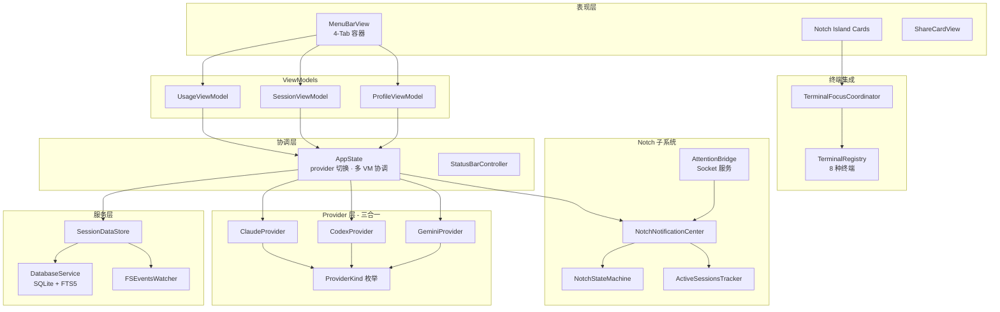
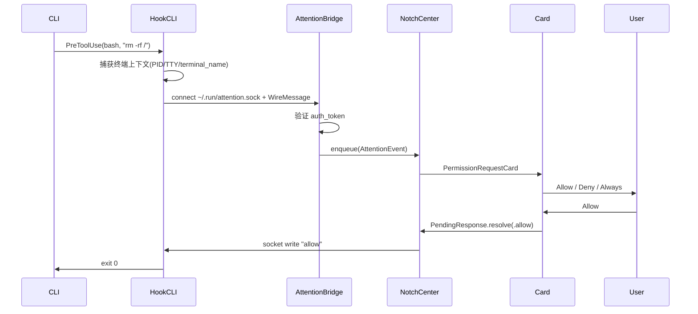
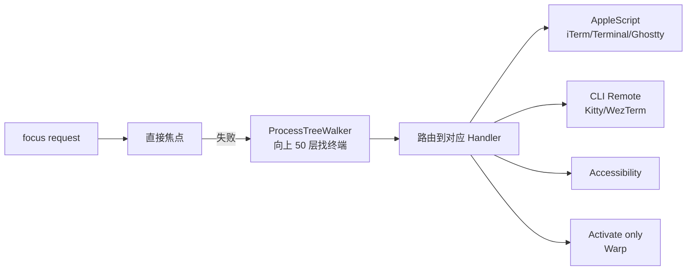
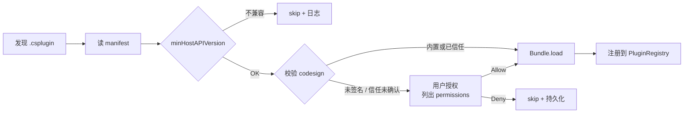
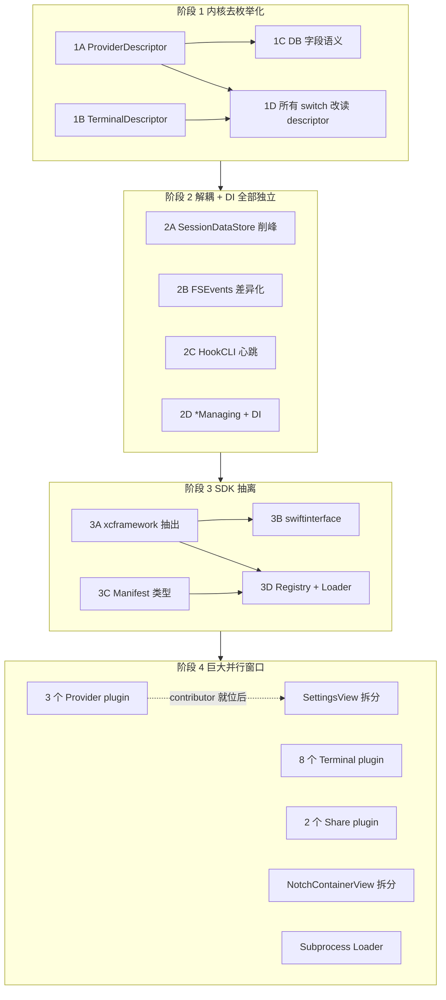
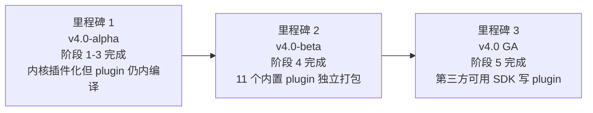

# Claude Statistics 架构与重写计划

> 最后更新：2026-04-26
> 当前版本：v3.1.0（140 个 Swift 文件 / 8400 行测试）
> 目标版本：v4.0（插件化架构）

本文档是项目的**单一权威架构文档**，合并了原 `ARCHITECTURE.md`（现状描述）与 `ARCHITECTURE_REVIEW.md`（优化评估），并在此基础上规划了 v4.0 的插件化重写。

文档分两部分：

- **第一部分**：当前架构现状、亮点、已落地改进、遗留问题
- **第二部分**：v4.0 重写计划，把 Provider 与 Terminal 从内核硬编码改为可动态加载的插件

---

## 目录

**第一部分：现状（v3.1）**

1. [项目背景与技术栈](#1-项目背景与技术栈)
2. [整体架构概览](#2-整体架构概览)
3. [六大子系统简述](#3-六大子系统简述)
4. [架构亮点（重写保留）](#4-架构亮点重写保留)
5. [已落地的架构改进](#5-已落地的架构改进)
6. [仍待解决的问题](#6-仍待解决的问题)

**第二部分：v4.0 插件化重写**

7. [重写目标与非目标](#7-重写目标与非目标)
8. [核心决策](#8-核心决策)
9. [统一插件模型](#9-统一插件模型)
10. [Provider Plugin 设计](#10-provider-plugin-设计)
11. [Terminal Plugin 设计](#11-terminal-plugin-设计)
11A. [Share Plugin 设计（角色 + 主题）](#11a-share-plugin-设计角色--主题)
12. [内核去枚举化](#12-内核去枚举化)
13. [SDK Framework（ClaudeStatisticsKit）](#13-sdk-frameworkclaudestatisticskit)
14. [加载机制与目录布局](#14-加载机制与目录布局)
15. [官方示例插件清单](#15-官方示例插件清单)
16. [路线图](#16-路线图)
17. [验收清单](#17-验收清单)
18. [决策待定项](#18-决策待定项)

---

# 第一部分：现状（v3.1）

## 1. 项目背景与技术栈

### 1.1 定位

**Claude Statistics** 是一款 macOS 菜单栏应用，统一观察和管理三个主流 AI 编码 CLI 的使用情况：

| Provider | CLI | 默认日志位置 |
|----------|-----|--------------|
| **Claude** | `claude` (Claude Code) | `~/.claude/projects/**/*.jsonl` |
| **Codex** | `codex` (OpenAI Codex CLI) | `~/.codex/**/*.jsonl` + `~/.codex/state_5.sqlite` |
| **Gemini** | `gemini` (Google Gemini CLI) | `~/.gemini/**/*.json` |

核心能力：

- **统计仪表盘**：Token、成本、模型分解、项目分析、日历热力图
- **刘海屏通知（Notch Island）**：CLI 触发的权限请求、任务完成、等待输入等事件以卡片形式出现在屏幕顶部
- **终端焦点回归**：从刘海屏交互后自动把焦点切回原终端（iTerm2 / Ghostty / Kitty / WezTerm / Warp / VSCode / Cursor 等 8 种）
- **多账户管理**：Claude 支持 Sync / Independent 两种模式（均 OAuth）；Codex/Gemini 使用本地凭据
- **分享卡片**：把使用数据生成游戏化人格卡片导出 PNG

### 1.2 技术栈

- **UI**：SwiftUI 5.9 + AppKit（NSPanel / NSStatusItem）+ Swift Charts
- **并发**：Swift Concurrency（async/await + Actor + @MainActor）
- **数据**：libsqlite3 + FTS5 全文索引
- **文件监听**：FSEvents（C 层 0.5s + Swift 层 2s 两级防抖）
- **IPC**：Unix Domain Socket + JSON 换行分隔协议（`~/.run/attention.sock`）
- **依赖**：Sparkle 2.6 / MarkdownView 2.6 / TelemetryDeck 2.0

### 1.3 入口配置

- `LSUIElement = true`（纯菜单栏应用，无 Dock 图标）
- `NSAppleEventsUsageDescription` + `NSAccessibilityUsageDescription`（终端 AppleScript + 焦点 AX API）

---

## 2. 整体架构概览

### 2.1 分层架构



### 2.2 模块目录映射

```
ClaudeStatistics/
├── App/                  — 启动入口、AppDelegate、StatusBarController、AppState
├── HookCLI/              — Hook 二进制入口（与主 App 同一可执行文件）
├── Models/               — 领域模型（Session, ProviderKind, UsageData, ShareMetrics）
├── ViewModels/           — MVVM 的 VM 层（3 个）
├── Views/                — SwiftUI 视图
├── Services/             — DB / FS 事件 / 历史 / 分享引擎
├── Providers/            — 三个 Provider 子目录
│   ├── Claude/           — OAuth、账户管理、UsageAPI
│   ├── Codex/            — SQLite 监听、内部 API
│   └── Gemini/           — 配额桶模型、Pricing 服务
├── NotchNotifications/   — 刘海屏通知子系统
│   ├── Core/             — 事件总线、状态追踪
│   ├── UI/               — NotchWindow、卡片、状态机
│   └── Hooks/            — 3 个 Hook 安装器
├── Terminal/             — 终端注册表与能力（8 种）
├── TerminalFocus/        — 焦点回归路由与 Focuser
├── Utilities/            — AutoRefresh、HotKey、SharePNG 导出
└── Resources/            — Localizable.strings (en / zh-Hans)
```

### 2.3 跨模块交互边界

- **UI ↔ VM**：`@ObservedObject` 单向数据流
- **VM ↔ Service**：`async/await` + Combine `@Published`
- **Service ↔ Provider**：通过 `SessionProvider` 协议多态
- **App ↔ CLI**：Unix Domain Socket + JSON 换行分隔协议
- **App ↔ Terminal**：AppleScript / CLI 命令 / Accessibility / NSWorkspace activate

---

## 3. 六大子系统简述

### 3.1 应用启动（双入口二进制）

主 App 与 HookCLI **共用同一可执行文件**，通过命令行参数区分入口：

```swift
// App/main.swift
if let exitCode = HookCLI.runIfNeeded(arguments: CommandLine.arguments) {
    exit(exitCode)
}
ClaudeStatisticsApp.main()
```

好处：单一二进制 + 稳定 TCC 身份，HookCLI 继承主 App 的辅助功能/AppleScript 授权。

### 3.2 Provider 多供应商架构

设计哲学：**Per-Provider Data, Shared Behavior** — 每个 Provider 自带它特有的数据（别名表、格式怪癖、鉴权方式），共享的是行为协议和规范化词汇。

数据流水线（每个 Provider 三步）：

```
CLI 写日志 → FSEventsWatcher (2s 防抖) → SessionScanner → TranscriptParser → SessionStats
                                                                                ↓
                                                         DatabaseService (SQLite + FTS5)
                                                                                ↓
                                                         @Published SessionDataStore → UI
```

Hook 流水线：

```
CLI 执行 hook → HookCLI 读 stdin → HookNormalizer → AttentionBridge (Unix Socket) → NotchNotificationCenter
```

`SessionProvider` 协议在 v3.1 已按能力拆分为 5 个窄协议（`SessionDataProvider` / `UsageProvider` / `AccountProvider` / `HookProvider` / `SessionLauncher`），通过 typealias 合集保留旧 API。

### 3.3 数据模型与存储

`SessionStats.fiveMinSlices` 是**唯一持久化的时间序列**，小时/日粒度均由其推导，保证聚合一致性。

SQLite schema（`~/Library/Application Support/ClaudeStatistics/Data.db`）：

- `session_cache`：`(provider, session_id) PK + file_size + mtime + quick_json + stats_json`
- `messages_fts5`：FTS5 索引列（`provider, session_id, role, content`）
- WAL 模式 + `PRAGMA synchronous = NORMAL`
- `stats_json` + FTS 索引在**同一事务**写入，失败回滚

`SessionDataStore` 解析编排：

- 解析并行 8 路 / DB 写入串行（避免 SQLite 锁争用）
- 指纹检测：`fileSize + mtime` 作为脏判据
- 崩溃恢复：有 `quick_json` 无 `stats_json` 的会话优先处理
- 重试不落盘：可疑结果重试一次仍不对就保留上次承诺版本

### 3.4 Notch Island 通知系统

CLI hook 事件转化为屏幕顶部动态岛式卡片。



**AttentionKind 优先级表**：

```
1. permissionRequest (最高)     5. sessionStart
2. taskFailed                    6. activityPulse (静默追踪)
3. waitingInput                  7. sessionEnd (最低)
4. taskDone
```

**NotchStateMachine** 三态：`idle / compact / expanded`，关键标记 `expandedViaHover` 区分"用户悬停偷看"与"事件驱动持久卡"。

**Socket 协议关键参数**：

- Permission request：`SO_RCVTIMEO = 280s` 阻塞等待用户决策
- 其他事件：`SO_RCVTIMEO = 2s` 内完成
- Auth：token 文件 `~/.run/attention-token`（权限 0o600）

### 3.5 终端焦点回归



每个 handler 采用"主策略 + fallback"三段式。Kitty 自动注入 `kitty.conf` 的 `allow_remote_control socket-only`；Ghostty 通过 stable surface ID 匹配。

### 3.6 UI 视图层

`MenuBarView` 4-Tab 容器：Sessions / Stats / Usage / Settings。Tab 动态可见性（如 Usage Tab 仅在 `ProviderCapabilities.supportsUsage` 时显示）。

`Theme.swift` 设计令牌：spacing / radius / shadows / animation / model colors / cost gradient。

分享卡片流程：`PeriodStats` → `ShareMetricsBuilder` → 9 个角色评分 (`ShareRoleEngine`) → `ShareCardView` SwiftUI 渲染 → `ImageRenderer` → PNG → Pasteboard。

---

## 4. 架构亮点（重写保留）

以下 9 条是骨架决策，**v4.0 重写必须保留**：

| 编号 | 亮点 | 价值 |
|---|---|---|
| **A1** | 双入口二进制（主 App + HookCLI 同一可执行文件） | 单一签名 → TCC 权限一次授权 |
| **A2** | Per-provider data, shared behavior 模式 | 加新 provider 只改自己的文件 |
| **A3** | `fiveMinSlices` 单一数据源 | 小时/日由 5 分钟桶推导，无聚合不一致 |
| **A4** | SQLite + FTS5 原子事务 | `stats_json` + FTS 同事务写，无半状态 |
| **A5** | NotchStateMachine `expandedViaHover` 标记 | 一布尔解决"误悬停 vs 事件驱动"难题 |
| **A6** | Socket 双向阻塞协议 | 比 XPC 轻、比 NSDistributedNotification 强；天然本地鉴权 |
| **A7** | 焦点回归分层（Route → Handler → Focuser） | 每层可独立替换 |
| **A8** | secondaryUsageViewModels 后台保活 | 解决"单 VM 只服务一个 Provider"与"UI 多 Provider 展示"矛盾 |
| **A9** | 解析并行 8 路 + DB 写串行 | 既用满 CPU 又避免 SQLite 锁争用 |

---

## 5. 已落地的架构改进

v3.1 已经完成的优化（**v4.0 重写不回退**）：

| 改进 | 落地形态 |
|---|---|
| ✅ AppState 拆分（实用版） | 抽出 `AccountManagers` / `ProviderContextRegistry` / `UsageVMRegistry` / `NotchRuntimeCoordinator`，AppState 358 → 230 行 |
| ✅ SessionProvider 协议按能力拆分 | 5 个窄协议 + typealias 合集，消费方零改动 |
| ✅ ActiveSessionsTracker 拆分 | 1430 → 722 行；抽出 `LivenessChecker` / `RuntimeStatePersistor` / `TerminalIdentityResolver` / `RuntimeSessionEventApplier` |
| ✅ 关键路径测试补齐 | 28 个测试文件 / 8400 行 / ~751 测试，覆盖 Parser / Normalizer / StateMachine / Tracker 子模块 |
| ✅ MenuBarView 瘦身 | 595 → 287 行，6 个内嵌子 View 拆出独立文件 |
| ✅ UserDefaults 部分集中 | 跨多文件复用的 raw key 集中到 `AppPreferences`；单文件单点 key 留在原处 |

---

## 6. 仍待解决的问题

### 6.1 v3.1 评估暂缓的项（v4.0 阶段 2 吃掉）

| 编号 | 问题 | 影响 |
|---|---|---|
| ⏸️ 4.1 | `SessionDataStore` 5 个 @Published 风暴，批处理触发 10× 重绘 | UI 性能；插件化后 N 个 store 引发 N 倍重绘 |
| ⏸️ 4.2 | FSEvents 防抖 2.5s 一刀切，单文件 append 与目录级变化未区分 | 用户感知延迟；plugin 各自延迟模型必须可声明 |
| ⏸️ 5.2 | HookCLI 280s 阻塞，主 App 关闭会挂死子进程 | 风险；plugin 引入新 hook 类型时被放大 |
| ⏸️ 5.4 | 全用单例 + 默认值构造，`*Managing` 协议未抽 | 测试 mock 困难；插件化要求构造器注入 |

### 6.2 文档未充分识别（阻挡插件化的根因）

直接核对代码后发现的硬耦合点：

#### A. `ProviderRegistry` 是 enum 硬编码 3 路 switch

```swift
static let supportedProviders: [ProviderKind] = [.claude, .codex, .gemini]
static func provider(for kind: ProviderKind) -> any SessionProvider {
    switch kind {
    case .claude: ClaudeProvider.shared
    case .codex:  CodexProvider.shared
    case .gemini: GeminiProvider.shared
    }
}
```

所有 provider 都是 `.shared` 单例，加新 provider 必须改 5+ 处 switch。

#### B. `ProviderKind` 是封闭枚举且强行做 UI 职责

```swift
var statusIconAssetName: String { switch self { case .claude: "ClaudeProviderIcon" ... } }
var accentColor: Color { switch self { ... } }
```

枚举既是身份键又是 UI 元数据来源，插件化要求两者分离。

#### C. `SessionProvider` typealias 强制全实现

5 个窄协议虽已拆出，但 `typealias SessionProvider = SessionDataProvider & UsageProvider & AccountProvider & HookProvider & SessionLauncher` 强制每个 plugin 实现所有 5 大块。Codex/Gemini 不需要 OAuth 也得伪实现 `fetchProfile`。

#### D. UI 层与 Provider 列表硬绑定

- `Views/SettingsView.swift` **2500 行**，4 个内嵌账户卡片、3 个 statusline 区段、3 个 hook 区段都是写死的
- `NotchNotifications/UI/NotchContainerView.swift` **2184 行**

#### E. 数据库 schema 与 `ProviderKind` 耦合

`provider` 字段当 PK 接 `ProviderKind.rawValue`。第三方 plugin 的 descriptor.id（如 `com.example.aider`）需要兼容。

### 6.3 文件级超大单元

| 文件 | 行数 | 处理 |
|---|---|---|
| `Views/SettingsView.swift` | **2500** | 拆到 plugin（账户卡 / 状态栏 / hook 区段下沉） |
| `NotchNotifications/UI/NotchContainerView.swift` | **2184** | 拆 Container + 各 Card 独立文件 + 布局 helper |
| `Services/SessionDataStore.swift` | 1333 | 拆 Store + ParseOrchestrator + RetryPolicy + RebucketEngine |
| `Services/ShareRoleEngine.swift` | 1177 | 拆 Engine + 9 个 RoleScorer |
| `Views/TranscriptView.swift` | 994 | 拆 Renderer + ContentBlocks + ToolBlocks |
| `Providers/Claude/TranscriptParser.swift` | 944 | 拆 Parser + EntryDecoder + StatsAggregator |
| `Views/StatisticsView.swift` | 915 | 拆 Period 维度 + 图表组件 |
| `Providers/Gemini/GeminiUsageService.swift` | 876 | 下沉到 GeminiPlugin |
| `Providers/Claude/StatusLineInstaller.swift` | 860 | 拆 ScriptRenderer + SettingsPatcher + BackupManager |

**红线：每个文件 ≤ 500 行**（v4.0 lint 强制）。

---

# 第二部分：v4.0 插件化重写

## 7. 重写目标与非目标

### 7.1 目标

- **模块化**：单文件硬上限 500 行，超大 View / Engine 拆到 ≤ 500 行
- **逻辑解耦**：内核不依赖任何具体 Provider 或 Terminal 代码，只依赖协议
- **可测试**：所有 plugin 可独立单元测试；内核提供 fake plugin 跑契约测试
- **新接入零成本**：加一个 Provider / Terminal = 在 `~/Library/.../Plugins/` 拖入一个 `.csplugin`，无需重新编译主 App
- **真正的插件化**：第三方可单独打包发布，链接公开的 `ClaudeStatisticsKit.xcframework` 即可

### 7.2 非目标

- **不追求 100% 沙盒化**：进程内 Bundle 加载承担崩溃传染风险，由签名校验 + 信任列表缓解，不强求 XPC 完全隔离
- **不支持运行时热更新**：加载/卸载 Plugin 需要重启 App
- **不把所有功能都插件化**：Notch 通知、统计聚合、PNG 渲染管道是产品核心，留在内核；插件化范围限于 **Provider / Terminal / 分享角色 / 分享主题** 四类外部能力适配

---

## 8. 核心决策

| 编号 | 决策 | 一句话理由 |
|---|---|---|
| **D1** | `ProviderKind` 枚举 → `ProviderDescriptor` 描述符 | 枚举封闭、无法运行时扩展 |
| **D2** | `TerminalRegistry` 静态 enum → `TerminalDescriptor` 描述符 | 同上 |
| **D3** | 主路径用 NSBundle 进程内加载（`.csplugin`） | 性能好、共享内存；崩溃风险由签名 + 信任列表缓解 |
| **D4** | 补充路径用独立进程 + JSON-RPC（`.cspluginx`） | 让社区可用 Python / Node / Rust 写 plugin |
| **D5** | 抽出 `ClaudeStatisticsKit.xcframework` 作为 SDK | 第三方只链接这一个 framework |
| **D6** | `Plugin` 协议统一 Provider / Terminal | 一套加载器、一套 manifest、一套权限模型 |
| **D7** | UI 槽位化（`ProviderViewContributor`） | `SettingsView` 2500 行根因是写死视图 |
| **D8** | 数据库 `provider` 字段语义改为不透明 String | 加新 plugin 不再需要 schema migration |
| **D9** | Plugin 必须 SemVer 声明 `minHostAPIVersion` | 主 App 升级 SDK 可拒载不兼容 plugin |
| **D10** | 内置 plugin 与第三方 plugin 走同一加载路径（dogfood） | 验证机制有效性 |
| **D11** | `ShareRole` 封闭 enum 拆为 `ShareRolePlugin` 贡献者 | 角色评分天然是扩展点；当前 1177 行 ShareRoleEngine 拆解的最优出口 |
| **D12** | 卡片视觉模板拆为 `ShareCardThemePlugin` 贡献者 | 用户/团队/节日主题可独立分发；社区可做娱乐化扩展 |

---

## 9. 统一插件模型

### 9.1 Plugin 抽象

```swift
public protocol Plugin: AnyObject {
    static var manifest: PluginManifest { get }
    init()
}

public struct PluginManifest: Codable, Sendable {
    public let id: String                    // "com.anthropic.claude" / "net.kovidgoyal.kitty"
    public let kind: PluginKind              // .provider / .terminal / .both
    public let displayName: String
    public let version: SemVer
    public let minHostAPIVersion: SemVer
    public let permissions: [PluginPermission]
    public let principalClass: String        // "ClaudeProviderPlugin"
    public let iconAsset: String?
}

public enum PluginKind: String, Codable, Sendable {
    case provider
    case terminal
    case shareRole          // 贡献分享卡片角色 + 评分
    case shareCardTheme     // 贡献分享卡片视觉模板
    case both               // provider + terminal 组合（罕见）
}

public enum PluginPermission: String, Codable, Sendable {
    case filesystemHome   = "filesystem.home"
    case filesystemAny    = "filesystem.any"
    case network
    case accessibility
    case appleScript
    case keychain
}
```

### 9.2 PluginRegistry

```swift
@MainActor
public final class PluginRegistry {
    public private(set) var providers:   [String: any ProviderPlugin]       = [:]
    public private(set) var terminals:   [String: any TerminalPlugin]       = [:]
    public private(set) var shareRoles:  [String: any ShareRolePlugin]      = [:]
    public private(set) var shareThemes: [String: any ShareCardThemePlugin] = [:]

    public func register(_ plugin: any Plugin) throws { ... }
    public func providerPlugin(id: String)   -> (any ProviderPlugin)?
    public func terminalPlugin(id: String)   -> (any TerminalPlugin)?
    public func shareRolePlugin(id: String)  -> (any ShareRolePlugin)?
    public func shareThemePlugin(id: String) -> (any ShareCardThemePlugin)?
}
```

### 9.3 PluginLoader（双模式）

```swift
@MainActor
public final class PluginLoader {
    public func loadAll() async -> LoadReport {
        var report = LoadReport()
        report.merge(loadBuiltins())                       // 主 App 编译时已 link
        report.merge(await loadBundles(from: pluginsDir))  // .csplugin
        report.merge(await loadSubprocesses(from: pluginsDir))  // .cspluginx
        return report
    }
}
```

### 9.4 信任与权限流程



- 内置 plugin 与主 App 同签名团队 ID → 自动信任
- 第三方 Developer ID 签名 + Notarization → 用户首次启用时一次性 prompt
- 未签名 plugin → 仅在"开发者模式"加载

---

## 10. Provider Plugin 设计

### 10.1 ProviderDescriptor

```swift
public struct ProviderDescriptor: Sendable {
    public let id: String                              // "com.anthropic.claude"
    public let displayName: String
    public let iconAsset: String                       // template image 资源名
    public let accentColor: ColorComponents            // 跨 SwiftUI/AppKit
    public let capabilities: ProviderCapabilities
    public let toolAliases: ToolAliasTable             // canonicalToolName 由 plugin 提供
    public let configDirectory: String                 // 用于 isInstalled 判定
    public let usagePresentation: ProviderUsagePresentation
    public let supportedNotchEvents: Set<NotchEventKind>
}
```

### 10.2 ProviderPlugin 协议（按需贡献）

```swift
public protocol ProviderPlugin: Plugin {
    var descriptor: ProviderDescriptor { get }

    func makeSessionDataProvider() -> any SessionDataProvider
    func makeUsageProvider()        -> (any UsageProvider)?
    func makeAccountProvider()      -> (any AccountProvider)?
    func makeHookProvider()         -> (any HookProvider)?
    func makeSessionLauncher()      -> any SessionLauncher
    func makeViewContributor()      -> (any ProviderViewContributor)?
}
```

**关键设计：** `makeXxx() -> Optional` —— Codex 没账户体系返回 nil；Gemini 没 OAuth 返回 nil。彻底放弃 v3.1 那个"5 个窄协议合并 typealias 强制全实现"的妥协。

### 10.3 ProviderViewContributor

```swift
@MainActor
public protocol ProviderViewContributor {
    func makeAccountCard(context: ProviderSettingsContext) -> AnyView?
    func makeStatusLineSection(context: ProviderSettingsContext) -> AnyView?
    func makeHookSection(context: ProviderSettingsContext) -> AnyView?
    func makeUsageView(context: ProviderUsageContext) -> AnyView?
    func makeMenuBarStripCell(context: MenuBarContext) -> AnyView?
}
```

`SettingsView` 不再写死，改为 `registry.providers.values.compactMap { $0.makeViewContributor()?.makeAccountCard(...) }`。预计：

- `Views/SettingsView.swift` 2500 → ~600 行
- 每个 Provider plugin 自带视图代码 ~600 行（搬出来，不是新增）

---

## 11. Terminal Plugin 设计

### 11.1 TerminalDescriptor

```swift
public struct TerminalDescriptor: Sendable {
    public let id: String                       // "com.googlecode.iterm2"
    public let bundleIds: [String]              // 同一终端的多个发行版
    public let displayName: String
    public let priority: Int                    // 多候选时偏好（1 最高）
    public let focusPrecision: FocusPrecision   // .exact / .bestEffort / .appOnly
    public let requiredPermissions: [PluginPermission]
}

public enum FocusPrecision: String, Sendable {
    case exact      // 能精确定位到具体 Tab/Window/Split
    case bestEffort // 能定位到 App，Tab 级别尽力
    case appOnly    // 只能 NSWorkspace.activate
}
```

### 11.2 TerminalPlugin 协议

```swift
public protocol TerminalPlugin: Plugin {
    var descriptor: TerminalDescriptor { get }

    func detectInstalled() -> Bool
    func makeFocusStrategy() -> any TerminalFocusStrategy
    func makeLauncher() -> any TerminalLauncher
    func makeSetupWizard() -> (any TerminalSetupWizard)?
    func makeContextProbe() -> (any TerminalContextProbe)?
}

public protocol TerminalFocusStrategy {
    func focus(target: TerminalFocusTarget) async -> FocusResult
}

public protocol TerminalLauncher {
    func launch(_ request: TerminalLaunchRequest) -> Bool
}

public protocol TerminalSetupWizard {
    var unmetRequirements: [TerminalRequirement] { get }
    func runAutomaticFix() async throws
    func makeView() -> AnyView
}

public protocol TerminalContextProbe {
    func probe(env: [String: String], procInfo: ProcInfo) -> TerminalContext?
}
```

### 11.3 终端的特殊处理插件化

- **Kitty**：`KittyFocusStrategy` 内部封装 socket 动态发现 + remote control，`KittySetupWizard` 负责 `kitty.conf` 自动注入
- **Ghostty**：`GhosttyFocusStrategy` 内部封装 AppleScript + stable surface ID 匹配，`GhosttyContextProbe` 从 env 读 surface id

`ProcessTreeWalker`（进程树回溯）作为通用基础设施留在内核，作为 SDK 公开 API 供所有 terminal plugin 调用。

---

## 11A. Share Plugin 设计（角色 + 主题）

### 11A.1 拆分原则

| 留在内核 | 下沉到 plugin |
|---|---|
| `ShareMetrics` 数据模型（产品共识） | 角色 `id` / 显示名 / 徽章资源 |
| `ShareMetricsBuilder` 派生指标（活跃度 / 夜间比 / 工具消息比 / 多模型比例…） | 角色评分函数（如何把指标映射到分数） |
| PNG 渲染管道（`ImageRenderer` → `Pasteboard`） | 卡片 SwiftUI 视图模板 |
| `SharePreviewWindow` 浮窗壳（裸 chrome） | 模板内部排版 / 配色 / 插画 |
| 多角色去重 / 冲突仲裁逻辑 | — |

### 11A.2 ShareRolePlugin 协议

```swift
public protocol ShareRolePlugin: Plugin {
    var roles: [ShareRoleDescriptor] { get }
    func evaluate(metrics: ShareMetrics, baseline: ShareMetrics?) -> [ShareRoleScore]
}

public struct ShareRoleDescriptor: Sendable {
    public let id: String                       // "com.anthropic.role.night-shift"（全局唯一）
    public let displayName: LocalizedKey
    public let badgeAsset: ResourceRef          // plugin 自带的徽章插画
    public let category: ShareRoleCategory      // .session / .allTime
    public let proofMetricKeys: [String]        // 用户看到的"为什么是我"指标列表
}

public struct ShareRoleScore: Sendable {
    public let roleId: String
    public let score: Double                    // 0-1
    public let proofValues: [String: String]    // 渲染时填到 proof 区
    public let badges: [ShareBadge]             // 副徽章（可选）
}
```

### 11A.3 ShareCardThemePlugin 协议

```swift
public protocol ShareCardThemePlugin: Plugin {
    var themes: [ShareCardThemeDescriptor] { get }
    func makeCardView(input: ShareCardInput) -> AnyView
}

public struct ShareCardThemeDescriptor: Sendable {
    public let id: String                       // "com.anthropic.theme.classic"
    public let displayName: LocalizedKey
    public let previewAsset: ResourceRef
    public let supportedCategories: Set<ShareRoleCategory>
}

public struct ShareCardInput: Sendable {
    public let role: ShareRoleResult
    public let metrics: ShareMetrics
    public let theme: ShareCardThemeDescriptor
    public let userPreferences: ShareCardPreferences
}
```

### 11A.4 内核侧编排

```swift
@MainActor
public final class ShareCoordinator {
    private let registry: PluginRegistry
    private let metricsBuilder: ShareMetricsBuilder

    public func buildResult(for period: PeriodStats) -> ShareRoleResult? {
        let metrics = metricsBuilder.build(from: period)
        let allScores = registry.shareRoles.values.flatMap {
            $0.evaluate(metrics: metrics, baseline: ...)
        }
        return arbitrate(scores: allScores)   // 去重 + 选最高分
    }

    public func makeCardView(result: ShareRoleResult, themeId: String) -> AnyView? {
        guard let plugin = registry.shareThemePlugin(id: themeId) else { return nil }
        return plugin.makeCardView(input: .init(role: result, ...))
    }
}
```

### 11A.5 冲突与仲裁

- **角色 ID 全局唯一**：`com.<vendor>.role.<name>` 命名规范，多 plugin 注册重复 id 时启动期报错
- **多 plugin 同时贡献**：内核仲裁器按 `score` 取最高；并列时按 `role.priority` 然后 plugin 注册顺序
- **用户启用面板**：Settings → Share → Roles 列表，每个角色独立开关，与 Provider/Terminal 一致的 UI 模式
- **主题独立选择**：用户在分享对话框里下拉选主题，不与角色耦合

### 11A.6 拆分后的尺寸

| 现状 | v4.0 |
|---|---|
| `ShareRoleEngine.swift` 1177 行 | `ShareCoordinator.swift` ~150 行（仅编排）+ 9 个 ShareRolePlugin（各 ~120 行） |
| `Models/ShareRole.swift` 186 行（封闭 enum） | 删除 enum；`ShareRoleDescriptor` 进 SDK |
| `Views/ShareCardView.swift` 544 行 | 默认主题 plugin 自带（~500 行）；内核仅留 `SharePreviewWindow` 壳 |

---

## 12. 内核去枚举化

### 12.1 必须删除的 `switch self` 路径

| 现状代码 | 替换 |
|---|---|
| `ProviderKind.canonicalToolName(raw)` 内 switch | 改为读 `descriptor.toolAliases.canonical(raw)` |
| `ProviderKind.statusIconAssetName` / `accentColor` | 改为读 `descriptor.iconAsset` / `descriptor.accentColor` |
| `ProviderRegistry.provider(for: kind)` switch | 改为 `registry.providerPlugin(id:)?.makeSessionDataProvider()` |
| `ProviderCapabilities.<name>` 静态常量 | 移到各 plugin 的 descriptor |
| `TerminalRegistry` 顶层 enum 注册表 | 改为 `PluginRegistry.terminals` 动态字典 |
| `TerminalFocusRoute` enum + 5 个 handler | 删除路由层；`focus(target:)` 直接由 plugin strategy 处理 |
| `ShareRole` 封闭 enum + `ShareRoleEngine` 1177 行的 9 路 switch | 删除 enum；改读 `ShareRolePlugin.roles` + `ShareCoordinator.arbitrate` |

### 12.2 数据库 schema 字段

字段类型不变（仍是 `TEXT`），但**语义上不再绑定 `ProviderKind` 枚举值**：第三方 plugin 用自己的 `descriptor.id`（如 `"com.example.aider"`）作为 provider 列值。已有 `claude` / `codex` / `gemini` 三行不需要 migration —— 内置 plugin 的 descriptor.id **保持原 rawValue 兼容**。

### 12.3 `ProviderKind` 兼容层

```swift
@available(*, deprecated, message: "Use ProviderDescriptor via PluginRegistry instead")
public enum ProviderKind: String {
    case claude
    case codex
    case gemini
}

extension ProviderKind {
    public var descriptorId: String { rawValue }
}
```

保留是为了渐进迁移；M3 后两个版本（v4.2）废弃，v5.0 移除。

---

## 13. SDK Framework（ClaudeStatisticsKit）

### 13.1 公开 API 表面

```
ClaudeStatisticsKit.xcframework/
├── Plugin Core
│   ├── Plugin / PluginManifest / PluginPermission
│   ├── PluginKind / SemVer / LoadedPluginInfo
│   └── PluginRegistry (公共读，内核管写)
│
├── Provider API
│   ├── ProviderPlugin / ProviderDescriptor
│   ├── ProviderCapabilities / ProviderUsagePresentation
│   ├── SessionDataProvider / UsageProvider / AccountProvider
│   ├── HookProvider / SessionLauncher / SessionWatcher
│   ├── ProviderViewContributor (SwiftUI)
│   └── ToolAliasTable / CanonicalToolName
│
├── Terminal API
│   ├── TerminalPlugin / TerminalDescriptor
│   ├── TerminalFocusStrategy / TerminalLauncher
│   ├── TerminalSetupWizard / TerminalContextProbe
│   ├── FocusPrecision / FocusResult
│   └── ProcessTreeWalker (公开供 plugin 复用)
│
├── Share API
│   ├── ShareRolePlugin / ShareRoleDescriptor / ShareRoleScore
│   ├── ShareCardThemePlugin / ShareCardThemeDescriptor
│   ├── ShareMetrics / ShareCardInput / ShareRoleResult
│   └── ShareRoleCategory / ShareBadge
│
├── Models (Codable, Sendable)
│   ├── Session / SessionStats / DaySlice / SessionQuickStats
│   ├── UsageData / UsageWindow
│   ├── TranscriptEntry / TranscriptDisplayMessage
│   ├── HookPayload / HookAction / NotchEventKind
│   └── ModelPricing / TrendDataPoint
│
└── Utilities
    ├── DiagnosticLogger (公开 plugin 写日志接口)
    ├── FSEventsWatcher (默认实现)
    └── PluginPaths (helper：plugin 自己的 cache/log 目录)
```

### 13.2 Module Stability

- 编译时启用 `BUILD_LIBRARY_FOR_DISTRIBUTION = YES` → 生成 `.swiftinterface`
- 接口冻结：`@frozen` 标注稳定结构体；非 `@frozen` 类型保留扩展空间
- 用 SemVer 标记：`MAJOR.MINOR.PATCH`，主版本变化才允许破坏性变更

### 13.3 SDK 版本与主 App 版本

主 App 主版本号锁 SDK 主版本号；plugin manifest 校验：

```swift
guard manifest.minHostAPIVersion <= ClaudeStatisticsKit.currentAPIVersion else {
    throw PluginLoadError.apiVersionTooLow(required: manifest.minHostAPIVersion)
}
```

---

## 14. 加载机制与目录布局

### 14.1 目录结构

```
~/Library/Application Support/Claude Statistics/
├── Plugins/
│   ├── builtins/                            # 主 App 安装时落地，与 App 同签名
│   │   ├── claude.csplugin/
│   │   ├── codex.csplugin/
│   │   ├── gemini.csplugin/
│   │   ├── iterm2.csplugin/
│   │   ├── apple-terminal.csplugin/
│   │   ├── ghostty.csplugin/
│   │   ├── kitty.csplugin/
│   │   ├── wezterm.csplugin/
│   │   ├── alacritty.csplugin/
│   │   ├── warp.csplugin/
│   │   └── editor.csplugin/                 # VSCode / Cursor / JetBrains 合一
│   ├── community/                           # 用户拖入的第三方
│   ├── disabled/                            # UI 关闭的搬到这里
│   ├── trust.json                           # 已批准的第三方 plugin 指纹
│   └── load-report.json                     # 上次加载结果
└── Cache/Plugins/<plugin-id>/                # 每个 plugin 的私有 cache 目录
```

### 14.2 .csplugin Bundle 结构

```
example.csplugin/
└── Contents/
    ├── Info.plist                # CFBundleIdentifier + ClaudeStatsManifestPath
    ├── manifest.json             # PluginManifest (Codable)
    ├── Resources/
    │   ├── icon.pdf
    │   └── Localizable.strings
    └── MacOS/
        └── example                # dylib（@rpath/ClaudeStatisticsKit.framework）
```

### 14.3 .cspluginx（独立进程版本）

```
example.cspluginx/
└── Contents/
    ├── manifest.json             # transport: "subprocess"
    ├── Resources/
    └── MacOS/
        └── example                # 任意可执行文件（Python/Node/Rust 编译产物）
```

启动时 `Process` fork，通过 stdin/stdout JSON-RPC 通信。协议 schema 在 SDK 文档冻结。

### 14.4 主 App entitlements 调整

```xml
<!-- ClaudeStatistics.entitlements -->
<key>com.apple.security.cs.disable-library-validation</key>
<true/>
<key>com.apple.security.cs.allow-unsigned-executable-memory</key>
<false/>
```

`disable-library-validation` 是 Bundle 模式动态加载的前提（**决策项 Q1，待确认**）。

---

## 15. 官方示例插件清单

把现有 13 个内置能力（3 Provider + 8 Terminal + 1 角色组 + 1 主题）全部改造为 plugin，作为官方示例。每个 plugin 完整带 SwiftUI 视图、测试、README、独立 Xcode target。

### 15.1 Provider 插件（3 个）

| Plugin ID | 目录 | 行数预估 | 实现的协议 |
|---|---|---|---|
| `com.anthropic.claude` | `Plugins/Sources/ClaudePlugin/` | ~3500 | Provider + Usage + Account + Hook + Launcher + ViewContributor |
| `com.openai.codex` | `Plugins/Sources/CodexPlugin/` | ~2800 | Provider + Usage + Account + Hook + Launcher + ViewContributor |
| `com.google.gemini` | `Plugins/Sources/GeminiPlugin/` | ~3000 | Provider + Usage + Account + Hook + Launcher + ViewContributor |

每个 Provider plugin 的内部模块化：

```
ClaudePlugin/
├── Plugin.swift                    # @main ClaudeProviderPlugin: ProviderPlugin
├── Manifest.swift                  # PluginManifest 静态常量
├── Descriptor.swift                # ProviderDescriptor 构造
├── Data/
│   ├── SessionScanner.swift
│   ├── TranscriptParser.swift      # 当前 944 行 → 拆 Parser/EntryDecoder/StatsAggregator
│   └── ToolAliases.swift
├── Usage/
│   ├── UsageAPIService.swift
│   └── PricingCatalog.swift
├── Account/
│   ├── AccountManager.swift        # 当前 727 行 → 拆模式控制 / 凭据存取 / 多账户快照
│   ├── OAuthClient.swift
│   ├── OAuthCallbackServer.swift
│   ├── ManagedAccountStore.swift
│   ├── IndependentCredentialStore.swift
│   └── CredentialService.swift
├── Hook/
│   ├── HookInstaller.swift
│   └── HookNormalizer.swift
├── StatusLine/
│   ├── StatusLineInstaller.swift   # 当前 860 行 → 拆 ScriptRenderer/SettingsPatcher/BackupManager
│   └── ScriptResources/
├── Launcher/
│   └── SessionLauncher.swift
├── Views/
│   ├── AccountCardView.swift       # ProviderViewContributor.makeAccountCard
│   ├── HookSettingsSection.swift
│   ├── StatusLineSettingsSection.swift
│   └── UsageWindowsView.swift
├── Resources/
│   ├── Localizable.strings (en/zh-Hans)
│   ├── icon.pdf
│   └── icon-template.pdf
└── Tests/
    ├── TranscriptParserTests.swift  (从主项目搬过来)
    ├── HookNormalizerTests.swift
    └── ScannerTests.swift
```

### 15.2 Terminal 插件（8 个）

| Plugin ID | 目录 | Focus 策略 | 特殊处理 |
|---|---|---|---|
| `com.googlecode.iterm2` | `Plugins/Sources/ITermPlugin/` | AppleScript | — |
| `com.apple.Terminal` | `Plugins/Sources/AppleTerminalPlugin/` | AppleScript | — |
| `com.mitchellh.ghostty` | `Plugins/Sources/GhosttyPlugin/` | AppleScript + Surface ID | `GhosttyContextProbe` 从 env 读 surface id |
| `net.kovidgoyal.kitty` | `Plugins/Sources/KittyPlugin/` | Remote Control（unix socket） | `KittySetupWizard` 自动写 `kitty.conf` |
| `com.github.wez.wezterm` | `Plugins/Sources/WezTermPlugin/` | `wezterm cli activate-pane` | — |
| `org.alacritty` | `Plugins/Sources/AlacrittyPlugin/` | Accessibility | — |
| `dev.warp.Warp-Stable` | `Plugins/Sources/WarpPlugin/` | Activate-only | `focusPrecision = .appOnly` |
| `dev.zed.editor` 等 | `Plugins/Sources/EditorPlugin/` | Activate + 启动命令 | 多 bundle id（VSCode/Cursor/JetBrains/Zed） |

每个 Terminal plugin 结构（~150–400 行）：

```
KittyPlugin/
├── Plugin.swift              # @main KittyTerminalPlugin: TerminalPlugin
├── Manifest.swift
├── Descriptor.swift
├── Capability.swift          # 替换原 KittyTerminalCapability
├── Focus/
│   ├── KittyFocusStrategy.swift   # 当前 KittyFocuser
│   ├── SocketDiscovery.swift
│   └── RemoteControlClient.swift
├── Setup/
│   ├── KittySetupWizard.swift     # 当前 KittyFocusSetup
│   └── ConfigPatcher.swift
├── Launcher.swift
└── Tests/
    └── SocketDiscoveryTests.swift
```

### 15.3 Share 插件（2 个）

| Plugin ID | 目录 | 行数预估 | 内容 |
|---|---|---|---|
| `com.anthropic.official-share-roles` | `Plugins/Sources/OfficialShareRolesPlugin/` | ~1100 | 9 个内置角色（vibeCodingKing / toolSummoner / contextBeastTamer / nightShiftEngineer / multiModelDirector / sprintHacker / fullStackPathfinder / efficientOperator / steadyBuilder） |
| `com.anthropic.classic-share-theme` | `Plugins/Sources/ClassicShareThemePlugin/` | ~600 | 当前 `ShareCardView` 的 SwiftUI 模板 + 默认配色 + 徽章插画 |

每个 Share plugin 结构：

```
OfficialShareRolesPlugin/
├── Plugin.swift                # @main OfficialShareRolesPlugin: ShareRolePlugin
├── Manifest.swift
├── Roles/
│   ├── VibeCodingKing.swift    # 当前 ShareRoleEngine 9 路 switch 的一支
│   ├── ToolSummoner.swift
│   ├── ContextBeastTamer.swift
│   ├── NightShiftEngineer.swift
│   ├── MultiModelDirector.swift
│   ├── SprintHacker.swift
│   ├── FullStackPathfinder.swift
│   ├── EfficientOperator.swift
│   └── SteadyBuilder.swift
├── Resources/
│   ├── badges/                 # 9 个徽章 PDF
│   └── Localizable.strings
└── Tests/
    └── RoleScoringTests.swift  (从主项目搬过来)

ClassicShareThemePlugin/
├── Plugin.swift                # @main ClassicShareThemePlugin: ShareCardThemePlugin
├── Manifest.swift
├── Themes/
│   └── ClassicTheme.swift
├── Views/
│   ├── CardView.swift          # 当前 ShareCardView 主体
│   ├── ProofMetricsBlock.swift
│   ├── BadgeStrip.swift
│   └── HeaderBlock.swift
├── Resources/
│   ├── illustrations/
│   └── Localizable.strings
└── Tests/
    └── SnapshotTests.swift
```

### 15.4 示例 plugin 的统一规范

- 每文件 ≤ 500 行（v4.0 lint 强制）
- 公开 API ≤ 20 个（实现细节用 `internal`）
- 测试与源代码同包（plugin 自带测试 target）
- README：声明权限、最小 host 版本、构建步骤
- 不依赖主 App 内核：只 `import ClaudeStatisticsKit`

---

## 16. 路线图

### 16.1 阶段顺序


| 阶段 | 任务 | 风险 |
|---|---|---|
| **阶段 1 内核去枚举化** | `ProviderDescriptor` 替换 `ProviderKind` / `TerminalDescriptor` 替换 `TerminalRegistry` / DataStore + DB 字段语义改 String / 所有 `switch self` 改读 descriptor | 中（涉及全量 grep + 改 switch） |
| **阶段 2 解耦 + DI** | `SessionDataStore` snapshot 削峰（4.1）/ FSEvents 差异化防抖（4.2）/ HookCLI 心跳（5.2）/ `*Managing` 协议 + DI（5.4） | 低（已有 review 文档铺垫） |
| **阶段 3 SDK 抽离** | `ClaudeStatisticsKit.xcframework` 抽出 / Public API 加 `swiftinterface` / `PluginManifest` + `Permission` + `SemVer` / `PluginRegistry` + `PluginLoader` 内核接入 | 高（API 表面冻结需谨慎） |
| **阶段 4 内置 plugin 改造** | 3 个 Provider plugin / 8 个 Terminal plugin / `OfficialShareRolesPlugin` / `ClassicShareThemePlugin` / `SettingsView` 与 `NotchContainerView` 拆分 / Subprocess Loader (`.cspluginx`) | 中 |
| **阶段 5 第三方支持** | 签名 + 公证 + `trust.json` UI / SDK 文档 + 示例 plugin 仓库 / plugin marketplace 设计（远期） | 中 |

### 16.2 并行开发批次

阶段 1-3 是基础设施串行依赖；阶段 4 是 13 路并行的最大窗口。下表把每项任务标记为可并行批次，配合 `git worktree` 各开独立分支推进。

#### 任务依赖图



#### 推荐启动批次

| 批次 | 何时启动 | 并行任务 | 工作流建议 |
|---|---|---|---|
| **B0 准备** | 立即 | 创建 `Plugins/` 目录骨架 / `ClaudeStatisticsKit` 空 framework target / 加 lint 规则（单文件 ≤ 500 行） | 主线一次性提交 |
| **B1 阶段 1 起步** | B0 后 | 1A ProviderDescriptor ‖ 1B TerminalDescriptor | 两条 worktree 并行；descriptor 类型先在两条线各自定义，B2 时合并对齐 |
| **B2 阶段 1 收尾** | B1 合并后 | 1C DB 字段语义 ‖ 1D switch 全量改读 | 两条 worktree；1D 涉及全文 grep 改动面广，单独 PR |
| **B3 阶段 2 全开** | B2 合并后 | 2A 削峰 ‖ 2B FSEvents ‖ 2C HookCLI ‖ 2D *Managing | **4 路完全并行**（任务彼此独立）；分 4 个 worktree |
| **B4 阶段 3 起步** | B3 合并后 | 3A xcframework 抽出 ‖ 3C Manifest 类型 | 2 路并行；3C 不依赖 3A 的实际代码搬迁，可独立设计 |
| **B5 阶段 3 收尾** | B4 合并后 | 3B swiftinterface ‖ 3D Registry + Loader | 2 路并行 |
| **B6 阶段 4 plugin 大并行** | B5 合并后 | 13 个 plugin **全独立**：3 Provider + 8 Terminal + 2 Share；同时启动 4L Subprocess Loader | **最高 14 路并行**；建议分批 4-6 路同时 |
| **B7 UI 拆分** | B6 进行中（plugin 的 ViewContributor 完成 ≥ 50%） | 4U1 SettingsView 拆 ‖ 4U2 NotchContainerView 拆 | 2 路并行；依赖 plugin contributor 已注入 |
| **B8 阶段 5** | B7 合并后 | 5A 签名 + 公证 + trust.json UI ‖ 5B SDK 文档 + 示例仓库 | 2 路并行 |

#### 关键同步点

每个批次合并回主分支前必须满足：

1. **B2 合并前**：执行回归 checklist（17.7 节），确认行为等价
2. **B3 合并前**：性能基线对比（17.6 节），不退化
3. **B5 合并前**：跑一个 hello-world plugin 验证 SDK 能用
4. **B6 各 plugin 合并前**：删除该 plugin 后 App 不崩，仅缺对应能力（17.4 节验收）
5. **B7 合并前**：`Views/SettingsView.swift` 与 `NotchContainerView.swift` 行数验证 < 500
6. **B8 合并前**：未签名 plugin 能被正确拒载

#### git worktree 工作流

```bash
# 主仓库（永远在 main 分支）
~/claude-statistics/

# 为每个并行批次开 worktree
git worktree add ../cs-1a refactor/provider-descriptor
git worktree add ../cs-1b refactor/terminal-descriptor
git worktree add ../cs-2a refactor/datastore-snapshot
git worktree add ../cs-2b refactor/fsevents-differentiated
# ... 每个批次一个 worktree

# B6 阶段 4 期间最多可同时持有 14 个 worktree
git worktree add ../cs-4-claude   plugin/claude
git worktree add ../cs-4-codex    plugin/codex
git worktree add ../cs-4-gemini   plugin/gemini
git worktree add ../cs-4-iterm    plugin/iterm
# ... 11 个 plugin worktree
```

每个 worktree 独立运行 `bash scripts/run-debug.sh` 验证，PR 合并后再 `git worktree remove`。

#### 单人 vs 多人 vs Agent 并行

| 协作模式 | 阶段 1-3 | 阶段 4 | 备注 |
|---|---|---|---|
| **单人手动** | 串行（每批等合并后启下一批） | 一次开 2-3 路 worktree | 主要受人脑切换成本限制 |
| **单人 + Claude Code agents** | 1 主 + 1-2 agent 跑独立 worktree | **每个 plugin 派一个 agent**，B6 可达 8-13 路 | 适合本项目（plugin 间彻底解耦） |
| **多人** | 拆 1A/1B 给两人 | 每人 2-3 个 plugin | 阶段 4 是最理想的多人协作窗口 |

---

### 16.3 里程碑



- **M1（v4.0-alpha）**：内核已去枚举化，`disable-library-validation` 还**未启用**，行为与 v3.x 完全等价。
- **M2（v4.0-beta）**：内置 plugin 抽出到 `Plugins/builtins/`，启用 `disable-library-validation`。dogfood 关键节点。
- **M3（v4.0 GA）**：发布 `ClaudeStatisticsKit.xcframework` + SDK 文档站。开放第三方提交。

---

## 17. 验收清单

### 17.1 阶段 1 验收

- [ ] 全文 `grep "switch.*\.claude.*\.codex.*\.gemini"` 命中数 = 0
- [ ] 全文 `grep "ProviderKind\."` 命中只在 SDK 兼容层 + descriptor.id helper
- [ ] `TerminalRegistry.swift` 删除
- [ ] 加一个虚拟的 `FakeProvider` plugin，启动后 Settings 看到第 4 个 provider 卡片
- [ ] 现有所有功能（FS scan / parse / usage refresh / OAuth / Notch / focus）行为不变

### 17.2 阶段 2 验收

- [ ] Instruments → SwiftUI：批处理 8 个会话 → View body 调用 ≤ 2 次（来自 4.1）
- [ ] 终端发一条消息 → Session List 在 500ms 内出现新数据（来自 4.2）
- [ ] 关闭主 App → HookCLI 进程在 5s 内全部退出，无僵尸（来自 5.2）
- [ ] 至少 3 个 `*Managing` 协议有对应 mock，单元测试可注入（来自 5.4）

### 17.3 阶段 3 验收

- [ ] `ClaudeStatisticsKit.xcframework` 可独立编译
- [ ] 用 SDK 写一个 hello-world plugin，主 App 内 `PluginRegistry` 能识别
- [ ] `PluginManifest` Codable round-trip 测试通过
- [ ] `ClaudeStatisticsKit.swiftinterface` 文件存在并 `swift -frontend -compile-module-from-interface` 可解析

### 17.4 阶段 4 验收

- [ ] 删除 `Plugins/builtins/claude.csplugin/` → 启动后 Claude 完全消失（不影响 Codex/Gemini）
- [ ] 删除 `Plugins/builtins/kitty.csplugin/` → Kitty 焦点回归路径不可用，其他终端正常
- [ ] 删除 `Plugins/builtins/official-share-roles.csplugin/` → 分享对话框只剩"无可用角色"提示，主 App 不崩
- [ ] 装一个虚拟的 `HalloweenThemePlugin` → 分享对话框出现新主题选项，可正常导出 PNG
- [ ] 主 App 二进制大小较 v3.1 缩减 30% 以上
- [ ] `Views/SettingsView.swift` < 600 行（来自 D7）
- [ ] `NotchNotifications/UI/NotchContainerView.swift` < 500 行
- [ ] `Services/ShareRoleEngine.swift` 从代码库消失（拆到 plugin + 内核 ShareCoordinator）
- [ ] 所有单文件 ≤ 500 行

### 17.5 阶段 5 验收

- [ ] 第三方 plugin 拖到 `community/` → 启动时弹权限 prompt → 用户允许后注册
- [ ] 未签名 plugin 在非开发者模式被拒
- [ ] `minHostAPIVersion` 不兼容的 plugin 被 skip 而非崩溃
- [ ] SDK 文档站可访问，包含 ProviderPlugin / TerminalPlugin 教程

### 17.6 性能基线

| 指标 | 当前（基线） | 红线（劣化警报） |
|---|---|---|
| 启动到菜单栏可点击 | ~1.5s | > 2s |
| 面板打开延迟 | ~300ms | > 500ms |
| 切换 Provider 延迟 | ~500ms | > 1s |
| Permission Request Notch 显示延迟 | ~200ms | > 400ms |
| 内存（空闲） | ~80 MB | > 120 MB |
| 内存（打开 Panel + 1000 会话） | ~250 MB | > 400 MB |

### 17.7 功能回归 Checklist（每 PR 必跑）

- [ ] 启动 App → 菜单栏图标出现
- [ ] 点击图标 → 面板打开
- [ ] 切换 4 个 Tab → 内容正常
- [ ] 切换 Provider（Claude → Codex → Gemini）→ 数据刷新
- [ ] 打开会话详情 → 统计显示
- [ ] 打开 Transcript → 消息渲染
- [ ] 搜索关键词 → FTS 返回结果
- [ ] 打开 Settings → 6 个子面板展开
- [ ] Claude 登录（Independent 模式）→ OAuth 成功
- [ ] 触发 Permission Request → Notch 弹出
- [ ] 点击 Allow → CLI 继续执行
- [ ] 点击 Notch 会话 → 焦点回到终端
- [ ] 生成分享卡片 → PNG 导出

---

## 18. 决策待定项

需要在动手前拍板的关键问题：

| ID | 决策 | 影响 | 倾向 |
|---|---|---|---|
| **Q1** | 主 App 是否加 entitlement `com.apple.security.cs.disable-library-validation`？ | 是动态加载第三方 plugin 的前提；放弃苹果库校验保护 | 倾向"是"，里程碑 M2 启用 |
| **Q2** | 第三方 plugin 是否强制 Developer ID 签名 + Notarization？ | 强制 = 用户体验好；不强制 = 社区门槛低 | 倾向"强制 + 开发者模式开关豁免" |
| **Q3** | 是否需要 `.cspluginx`（独立进程 + JSON-RPC）模式？ | 工程量翻倍但社区可用任意语言写 | 倾向"M3 之后再做"，不阻塞 M1-M2 |
| **Q4** | `ClaudeStatisticsKit.xcframework` 是否独立成 GitHub 仓库？ | 独立 = 第三方易发现、版本清晰；同仓 = 维护简单 | 倾向"独立仓库 + 主仓 submodule"，M3 时迁移 |
| **Q5** | Plugin permission prompt 的粒度？文件系统是否细到子目录？ | 细 = 安全；粗 = 体验好 | 倾向"粗粒度（home/any 二级）+ 显示 plugin 自报用途" |
| **Q6** | `ProviderKind` 兼容层何时彻底移除？ | 提前移 = 代码干净；保留 = 老 plugin 兼容 | 倾向"M3 后两个版本（v4.2）废弃，v5.0 移除" |
| **Q7** | 阶段 4 拆分顺序：先 Provider 还是先 Terminal？ | Provider 复杂、依赖多；Terminal 简单、独立性强 | 倾向"先 Terminal（验证机制）→ 再 Provider（吃复杂场景）" |

确认这 7 项后，可以进入阶段 1 实施。

---

**文档终**。后续每个阶段开工前，建议在 `docs/` 下新建对应的 `phase-N-*.md` 子文档，记录该阶段的具体 PR 拆分、风险点处理与回归 checklist。
